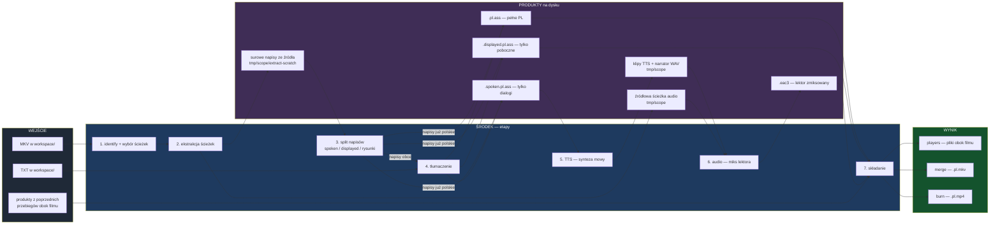
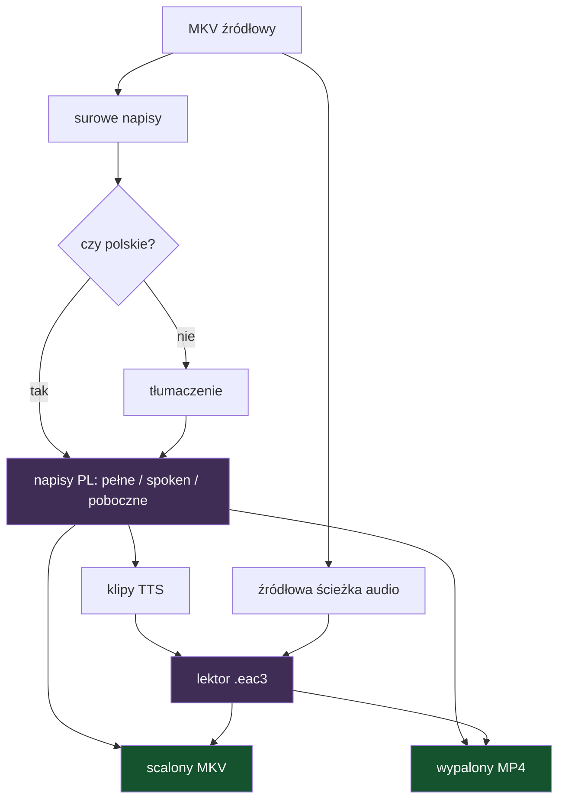
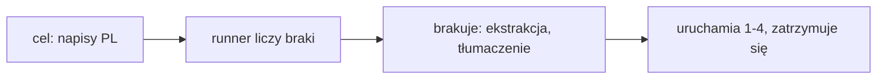

# Etap 7.1 — mapa stanów, produktów i trybów pracy

> Status: analiza przed wymaganiami — rozpisanie przestrzeni możliwości.
> Data: 2026-08-05.
> Poprzednik: [`etap-7-wymagania.md`](etap-7-wymagania.md) (zaimplementowany).
> Ten dokument opisuje **co program potrafi zrobić i w jakich kombinacjach**, zanim
> zdecydujemy, które kombinacje wystawić użytkownikowi i czym je sterować.

## 1. Problem

Dziś istnieją dokładnie dwa sposoby uruchomienia pracy:

- **Enter** — pełny przebieg: ekstrakcja → tłumaczenie → TTS → audio → składanie;
- **`/compose`** — samo składanie z tego, co już leży na dysku.

Wszystko pomiędzy jest niedostępne. Nie da się powiedzieć „wyciągnij mi tylko napisy",
„przetłumacz, ale nie czytaj", „wypal pełne napisy zamiast pobocznych". Produkty pośrednie
powstają przy okazji, ale nie są celem, który można wybrać.

Do tego wybór **co wypalić** jest zaszyty w macierzy (§7.4 etapu 7) i nie ma przełącznika.

## 2. Legenda decyzji

- **FAKT** — stan zastany, zweryfikowany w kodzie.
- **LUKA** — czego dziś nie da się zrobić.
- **PROPOZYCJA** — proponowane rozwiązanie, wymaga akceptacji.
- **HITL** — otwarta decyzja użytkownika.

## 3. Pełna mapa przepływu

**FAKT** — stan zastany, wszystkie ścieżki zweryfikowane w `pipeline/runner.py`.



## 4. Co wchodzi

**FAKT**

| Wejście | Wykrywanie | Uwagi |
|---|---|---|
| MKV z napisami obcymi | `discover_inputs`, `already_polish=False` | pełna ścieżka z tłumaczeniem |
| MKV z napisami polskimi | `already_polish=True` | tłumaczenie pomijane, produkty i tak powstają |
| MKV bez napisów tekstowych | `subtitle_id is None` | tylko audio; brak TTS i napisów |
| MKV bez ścieżki audio | `audio_id is None` | lektor bez podkładu |
| TXT | suffix `.txt` | brak wideo i osi czasu, wynik to `.pl.srt` |
| produkty poprzedniego przebiegu | `/compose`, dopasowanie po nazwie | pozwalają pominąć wszystko przed składaniem |

Filtr wejść odsiewa wyłącznie własne kontenery (`.pl.mkv`, `.pl.mp4`).

## 5. Co powstaje w środku

**FAKT** — pełny inwentarz z lokalizacjami.

| Produkt | Gdzie | Kasowany | Kto go tworzy |
|---|---|---|---|
| surowe napisy ze źródła | `tmp/<scope>/extract-scratch/` | tak, po udanym składaniu i na starcie kolejnego przebiegu | `extract_tracks` |
| źródłowa ścieżka audio | `tmp/<scope>/` | tak | `extract_tracks` |
| klipy TTS | `tmp/<scope>/tts/` | tak | `TtsService` |
| narrator WAV | `tmp/<scope>/audio/` | tak | `AudioService` |
| `{stem}.pl.<kind>` | korzeń `workspace/` | **nie** | `write_full` / `write_translated` |
| `{stem}.spoken.pl.<kind>` | korzeń `workspace/` | **nie** | `write_spoken` / `write_translated_spoken` |
| `{stem}.displayed.pl.<kind>` | korzeń `workspace/` | **nie** | `write_displayed` / `write_translated_displayed` |
| `{stem}.eac3` | obok źródłowego MKV | **nie** | `AudioService` |

Trwałe są więc cztery produkty: trzy warianty napisów i lektor. Reszta to stan przejściowy.

## 6. Co może wyjść

**FAKT**

| Wynik | Zawiera | Kiedy powstaje |
|---|---|---|
| `players` | nic nowego — porządkuje produkty obok filmu | zawsze, domyślny |
| `merge` → `.pl.mkv` | źródło + lektor + pełne PL + poboczne PL | gdy jest co dołożyć |
| `burn` → `.pl.mp4` | obraz z wypalonymi napisami + jedna ścieżka audio | gdy jest co wypalić albo lektor |

## 7. Graf zależności — czego wymaga każdy produkt

**FAKT** — to jest sedno: każdy cel ma swój najkrótszy łańcuch.



Wnioski z grafu:

- **napisy PL** wymagają wyłącznie ekstrakcji i (dla źródeł obcych) tłumaczenia — nie wymagają TTS;
- **lektor** wymaga napisów PL w wariancie spoken oraz ścieżki audio źródła;
- **scalanie i wypalanie** nie wymagają niczego poza gotowymi plikami — stąd `/compose`.

## 8. Przestrzeń celów użytkownika

**FAKT + LUKA** — czego można chcieć i czy da się to dziś dostać.

| # | Cel | Potrzebne etapy | Dziś |
|---|---|---|---|
| 1 | surowe napisy wyciągnięte ze źródła, bez tłumaczenia | 1-2 | **LUKA** — powstają w `tmp/` i są kasowane |
| 2 | napisy PL, bez lektora | 1-4 | **LUKA** — przebieg zawsze idzie dalej w TTS |
| 3 | napisy PL w trzech wariantach | 1-4 | jak wyżej |
| 4 | sam lektor `.eac3`, bez składania | 1-6 | tak, tryb `players` |
| 5 | lektor z gotowych napisów PL, bez tłumaczenia | 5-6 | **LUKA** — brak wejścia „mam już napisy" |
| 6 | scalony MKV | 1-7 | tak |
| 7 | wypalony MP4 z **pobocznymi** napisami | 1-7 | tak, gdy jest lektor |
| 8 | wypalony MP4 z **pełnymi** napisami mimo lektora | 1-7 | **LUKA** — macierz na to nie pozwala |
| 9 | wypalony MP4 bez napisów, sam lektor | 1-7 | tak, gdy brak napisów |
| 10 | złożenie z gotowych produktów | 7 | tak, `/compose` |
| 11 | wypalenie napisów źródłowych z MKV bez tłumaczenia | 1-2, 7 | tak dla polskich, **LUKA** dla obcych |
| 12 | merge i burn z jednego przebiegu | 7 dwa razy | **LUKA** — wariant jest jeden na przebieg |

Luk jest sześć i wszystkie mają ten sam charakter: **nie da się zatrzymać przebiegu wcześniej
ani wystartować go od środka**.

## 9. Trzy modele sterowania

**PROPOZYCJA** — do wyboru jeden; różnią się tym, gdzie mieszka decyzja.

### 9.1. Cel przebiegu (target-driven)

Użytkownik mówi, **czego chce**, a program liczy, których etapów brakuje, i reużywa tego,
co już leży na dysku. Jak `make`: cel plus zależności.



- **za**: jedna reguła obsługuje wszystkie 12 celów, w tym te nieprzewidziane; reużycie
  produktów jest darmowe; nie mnoży komend;
- **przeciw**: trzeba nazwać cele i pilnować, żeby nazwy były zrozumiałe.

### 9.2. Osobne komendy

`/subtitles`, `/translate`, `/tts`, `/compose`, `/burn` — każda robi swój kawałek.

- **za**: czytelne, odkrywalne przez `/help`, zero stanu między sesjami;
- **przeciw**: pięć komend zamiast jednej decyzji; każda musi sama policzyć, czego brakuje —
  albo padnie z „brak napisów"; kombinacje (np. cel 8) i tak wymagają flag.

### 9.3. Ustawienia w panelu

Pola typu „zatrzymaj po etapie" i „co wypalać" w `/settings`.

- **za**: zero nowych komend, wszystko w jednym miejscu;
- **przeciw**: to stan trzymany między sesjami — dokładnie ta pułapka, którą etap 7 świadomie
  odrzucił przy `/compose` (§6.4): zapomniane ustawienie po cichu zmienia, co robi Enter.

**Rekomendacja**: model 9.1 jako mechanizm, wyrażony jako **jedna komenda z celem**
(np. `/run subtitles`, `/run lektor`, `/run mp4`) plus dzisiejszy Enter = pełny przebieg.
Wybór wariantu napisów do wypalenia zostaje osobną osią (§10).

## 10. Wybór napisów do wypalenia

**HITL** — to bezpośrednie pytanie użytkownika.

Dziś decyduje macierz: jest lektor → poboczne, brak lektora → pełne. Możliwe warianty:

| Wariant | Sens |
|---|---|
| `auto` | dzisiejsza macierz — domyślne |
| `pełne` | cały tekst na obrazie, także przy lektorze |
| `poboczne` | tylko szyldy i notki |
| `źródłowe` | napisy z MKV bez tłumaczenia |
| `brak` | czysty obraz, sam lektor |

Miejsce decyzji — trzy opcje: globalne ustawienie w `/settings`, pytanie per plik w trybie
manualnym (jak dziś wybór ścieżek i stylów), albo argument celu (`/run mp4 pełne`).

## 11. Pytania otwarte

**HITL** — bez tych odpowiedzi nie ma sensu pisać wymagań wykonawczych.

1. **Czym sterujemy**: cel przebiegu (9.1), osobne komendy (9.2) czy ustawienia (9.3)?
2. **Wariant wypalania**: ustawienie globalne, pytanie w trybie manualnym, czy argument komendy?
3. **Surowe napisy ze źródła** (cel 1): czy mają zostawać obok filmu jako produkt, czy dalej
   być kasowanym stanem przejściowym?
4. **Obce napisy bez tłumaczenia** (cel 11): wolno wypalić angielskie napisy, czy to bez sensu
   w aplikacji, której celem jest polski lektor?
5. **Dwa wyniki naraz** (cel 12): czy jeden przebieg ma móc dać i MKV, i MP4?
6. **Lektor z gotowych napisów** (cel 5): czy `/compose` ma umieć dociągnąć TTS, gdy są napisy
   PL, ale nie ma `.eac3`, czy to osobny cel?

## 12. Rozstrzygnięcie 2026-08-05 — co teraz, co później

**USTALONE** — po przejrzeniu przestrzeni okazało się, że jest w niej za dużo, by decydować
teraz. Powód jest konkretny: dwanaście celów razy pięć wariantów napisów to **menu**, a wiersz
poleceń jest złym miejscem na menu. To problem interfejsu, nie składni komend.

Rozdzielenie odpowiedzialności, które to odblokowuje:

- **domena składania jest gotowa** — przyjmuje `CompositionPlan` i go wykonuje;
- **kto buduje ten plan** — pipeline, komenda czy przyszłe UI — można zmienić bez ruszania domeny.

Dlatego model trybów pracy (§9) **czeka na etap UI**. Nie ma jeszcze dla niego dokumentu;
istnieje jako intencja refaktoru shella (etap 2 przyjęty jako v1).

### 12.1. W tym etapie: wariant wypalania jako token komendy

**PROPOZYCJA**

```text
/compose            → macierz z §7.4 etapu 7 (poboczne przy lektorze)
/compose pelne      → wypala pełne napisy mimo lektora
/compose poboczne   → wymusza poboczne
```

Rejestr komend już obsługuje tokeny opcji (`/setup force`), więc koszt to pole `options`,
przekazanie wariantu do `build_plan` i testy macierzy. Zero ustawień, zero stanu między
sesjami, zero UI do zaprojektowania.

### 12.2. Odłożone do etapu UI

- cele przebiegu (zatrzymanie na napisach, na lektorze, start od środka);
- dwa wyniki z jednego przebiegu;
- surowe napisy ze źródła jako trwały produkt;
- miejsce decyzji o wariancie napisów, jeśli token komendy okaże się za ciasny.

### 12.3. Osobno, bez UI: reużycie gotowych napisów

**USTALONE — wymaganie usera 2026-08-05**

Ponowne naciśnięcie Enter tłumaczy wszystko od nowa, nawet gdy `{stem}.pl.<kind>` leży już
obok filmu. To kosztuje pieniądze na API i czas. Reużycie jest **zachowaniem domyślnym**,
a regeneracja — świadomym wyborem.

Zasada „jak najmniej wpisywać" ma tu swoją prawdziwą odpowiedź: program wnioskuje ze stanu
dysku, zamiast czekać na flagi. `/compose` już tak działa; Enter jeszcze nie.

**Reguła rozpoznania**: dla źródła `X.mkv` gotowym tłumaczeniem jest `X.pl.<kind>` w korzeniu
`workspace/`. Ten sam trzon nazwy plus infiks `.pl` — dokładnie kontrakt, w którym pipeline
sam zapisuje produkty. Dzięki temu działa to również dla napisów, które użytkownik przyniósł
sam, o ile nazwie je tak samo jak film.

**Co się dzieje przy trafieniu**:

| Etap | Los |
|---|---|
| identify + wybór ścieżek | wykonywany — potrzebny do ścieżki audio |
| ekstrakcja audio | wykonywana — lektor potrzebuje podkładu |
| ekstrakcja napisów | pomijana |
| **tłumaczenie** | **pomijane — tu jest cała oszczędność** |
| split na spoken/displayed | wykonywany lokalnie na gotowym pliku, bez API |
| TTS, audio, składanie | bez zmian |

**Regeneracja**: skasowanie `X.pl.<kind>` sprawia, że kolejny przebieg tłumaczy od nowa. Plik
leży w korzeniu `workspace/`, jest widoczny i użytkownik nim zarządza — w wersji pierwszej
to wystarcza za przełącznik.

**Widoczność**: reużycie zawsze trafia do raportu jako jawna informacja przy pliku. Cicha
podmiana źródła tłumaczenia byłaby dokładnie tą klasą niespodzianek, których zabrania §11.2b
etapu 7.

**HITL — otwarte**: czy potrzebny jest jawny przełącznik regeneracji obok kasowania pliku,
i czy reużycie ma obejmować także `.spoken.pl` i `.displayed.pl`, czy zawsze przeliczać je
z pełnego pliku.

## 13. Poza zakresem

Bez zmian względem etapu 7: brak skalowania rozdzielczości, brak akceleracji sprzętowej,
brak edycji i restylingu napisów, brak wielu ścieżek lektora, brak doklejania brakujących
czcionek do kontenera.
