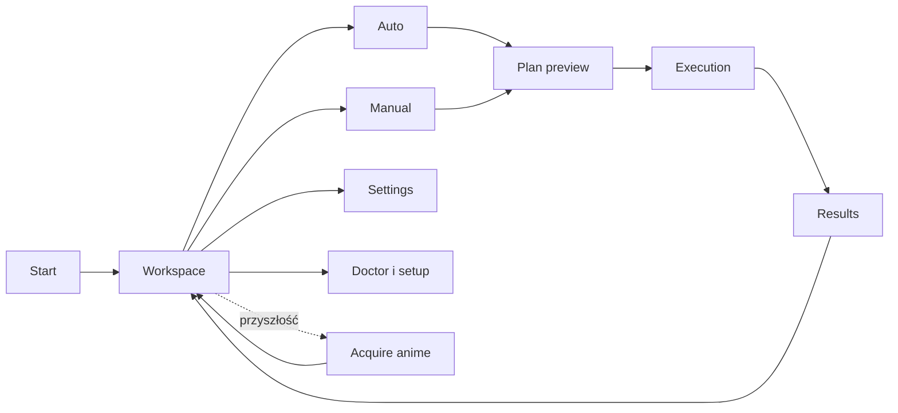

# Etap 9 — wymagania interfejsu

> Status: wymagania gotowe do akceptacji przed planem implementacji.
> Ostatnia aktualizacja: 2026-08-09.
> Kontrakt produktu: [etap-9-wymagania.md](etap-9-wymagania.md).
> Przyszłe pobieranie: [future/auto-download-anime.md](future/auto-download-anime.md).

## 1. Cel

Interfejs ma pozwolić obsłużyć pełny model AniShift bez zapamiętywania komend,
ukrytych skrótów ani wewnętrznych etapów pipeline'u. Musi pozostać cienkim
adapterem do wspólnego application API, aby późniejsze GUI albo automatyzacja nie
wymagały przepisywania planera i serwisów.

Dokument opisuje zachowanie interfejsu. Nie ustala jeszcze kolorów, dokładnych
wymiarów widgetów ani kompletnej mapy skrótów klawiszowych.

## 2. Warunki rzeczywistego produktu

Decyzja nie może wynikać wyłącznie z obecnego wyglądu REPL-a. AniShift docelowo
obsługuje:

- paczkę wielu filmów z jednym presetem `auto`;
- niezależny plan `manual` dla każdej grupy plików;
- wiele źródeł napisów, audio i obrazu;
- kilkadziesiąt ustawień, w tym pola zależne od silnika, modelu i głosu;
- plan przed uruchomieniem płatnych operacji;
- długie, współbieżne zadania z postępem, retry, fallbackiem i anulowaniem;
- częściowe sukcesy i błędy dotyczące pojedynczych grup;
- w przyszłości wyszukiwanie i pobieranie anime do workspace.

Jednocześnie jest to lokalna aplikacja dla jednego użytkownika. Etap 9 nie
potrzebuje serwera wieloużytkownikowego, kont, bazy danych ani zdalnego panelu.

## 3. Niezmienne wymagania UX

- Uruchomienie bez argumentów otwiera główny interfejs.
- Podstawowe operacje są widoczne na ekranie; command palette i skróty są tylko
  przyspieszeniem.
- Klawiatura wystarcza do całej obsługi, ale mysz działa tam, gdzie terminal ją
  udostępnia.
- Sam Enter nie uruchamia ukrytej, płatnej pracy.
- Przed startem użytkownik widzi źródła, plan, produkty, nadpisywane ścieżki i
  brakujące wymagania.
- Zapis ustawień, start pracy, anulowanie i wyjście są odrębnymi akcjami.
- Cofnięcie ekranu nie kasuje bez pytania wprowadzonych zmian.
- Kolor nigdy nie jest jedynym nośnikiem stanu.
- Interfejs nie blokuje się podczas sieci, FFmpeg, MKVToolNix ani TTS.
- Błąd jednej grupy nie zasłania postępu pozostałych grup.
- Układ działa od 100×30 znaków; przy mniejszym terminalu przechodzi w układ
  uproszczony albo pokazuje jednoznaczny komunikat.

## 4. Mapa przepływu użytkownika



Interfejs nie pokazuje użytkownikowi grafu domenowego jako edytora węzłów.
Planner przedstawia go jako czytelną listę operacji per grupa.

## 5. Ekrany

### 5.1. Workspace

Ekran startowy pokazuje:

- wykryte grupy plików;
- wybrane źródło główne i dostępne alternatywy;
- znalezione sidecary oraz istniejące produkty;
- problemy discovery i walidacji;
- akcje `Auto`, `Manual`, `Settings`, `Tools` i `Refresh`;
- ostatnie krótkie podsumowanie pracy, jeżeli istnieje w bieżącej sesji.

Tabela grup musi obsługiwać zaznaczanie, sortowanie i filtrowanie. Odświeżenie
workspace nie uruchamia pipeline'u.

### 5.2. Auto

- Użytkownik wybiera albo edytuje jeden preset dla całej paczki.
- Interfejs pokazuje, do ilu grup preset można zastosować.
- Grupy niewykonalne są oznaczone przed startem z konkretnym powodem.
- `auto` nie oferuje wyjątków per grupa. Nietypowe przypadki przechodzą do
  `manual`.
- Zapis presetu i jednorazowa zmiana uruchomienia są osobnymi akcjami.

### 5.3. Manual

- Każda grupa posiada własny, niezależny formularz zamiaru.
- Użytkownik wybiera film, napisy, audio, działanie tłumaczenia i produkty.
- Można wskazać ścieżkę osadzoną, exact-stem sidecar, zewnętrzny ASS/SRT,
  istniejący polski produkt albo zewnętrzne audio.
- Pola niezgodne z wybranym punktem startowym znikają albo są nieaktywne z
  widocznym wyjaśnieniem.
- Zamiar można skopiować na zaznaczone grupy, lecz powstają niezależne plany.
- Interfejs nie udostępnia surowych przełączników etapów pipeline'u.

### 5.4. Settings

- Ustawienia są grupowane według domeny i silnika.
- Zmiana silnika, modelu albo głosu aktualizuje widoczne pola bez restartu.
- Pole pokazuje etykietę, aktualną wartość, zakres, domyślną wartość i krótki
  opis.
- Sekrety pokazują wyłącznie stan konfiguracji, nigdy pełną wartość.
- Zmiany trafiają do wersji roboczej. `Save` zapisuje je jawnie, a `Cancel`
  przywraca stan wejściowy.
- Niedostępny silnik pozostaje widoczny wraz z przyczyną i proponowanym krokiem.

### 5.5. Plan preview

Przed uruchomieniem interfejs pokazuje dla każdej grupy:

- wybrane źródła i pominięte alternatywy;
- wynik automatycznych reguł wyboru;
- listę operacji w kolejności zależności;
- produkty trwałe i ścieżki, które zostaną zastąpione;
- użyte silniki, fallbacki i limity współbieżności;
- błędy uniemożliwiające start;
- ostrzeżenie przed operacjami płatnymi albo sieciowymi.

Start jest dostępny dopiero po poprawnym zaplanowaniu wszystkich wybranych grup.
W `ready_first` grupa błędna może zostać odznaczona bez przebudowy zamiaru innych
grup.

### 5.6. Execution

- Każda grupa ma jeden wiersz z bieżącą operacją, stanem i postępem.
- Szczegóły pokazują zadania serwisów, retry, fallback i skrócony błąd.
- Widok potrafi filtrować `running`, `failed`, `done` i wszystkie grupy.
- Postęp nie tworzy nieograniczonego strumienia nowych wierszy.
- `Cancel` anuluje application API, które zamyka sieć i subprocessy.
- Wyjście z aktywnej pracy wymaga potwierdzenia i opisuje skutek.

### 5.7. Results

- Podsumowanie rozdziela sukces, częściowy sukces, błąd i anulowanie.
- Każda grupa pokazuje utworzone produkty oraz zachowane wcześniejsze produkty.
- Błąd zawiera przyczynę, bezpieczne szczegóły i następną sensowną akcję.
- Można wrócić do workspace albo otworzyć plan `manual` dla nieudanej grupy.
- Interfejs nie oferuje automatycznego „napraw wszystko” bez pokazania nowego
  planu.

### 5.8. Tools

TUI udostępnia czytelny widok `doctor` i `setup`, ale te operacje pozostają także
dostępne z cienkiego CLI. Dzięki temu można naprawić środowisko, gdy główny
interfejs albo pipeline nie startuje poprawnie.

### 5.9. Przyszłe pobieranie anime

Etap 9 nie implementuje pobierarki. Interfejs rezerwuje jednak naturalny punkt
rozszerzenia `Acquire`, który może później zawierać:

- wyszukiwanie po tytule i numerze odcinka;
- tabelę wyników z rozmiarem, jakością, źródłem i dostępnością;
- wybór jednego wyniku albo batcha;
- postęp pobierania, pauzę i anulowanie obserwacji;
- przekazanie gotowych plików do ekranu workspace.

Nie wymaga to obrazów ani podglądu wideo. Jeżeli katalog z plakatami, miniaturami
i wizualnym przeglądaniem stanie się główną częścią produktu, należy ponownie
ocenić GUI zamiast wciskać grafikę do terminala.

## 6. Podział odpowiedzialności

```text
Textual TUI ─┐
             ├─> application API ─> planner/scheduler ─> services
Typer CLI ───┘
```

- TUI przechowuje wyłącznie stan prezentacji i wersje robocze formularzy.
- Application API przyjmuje typowane zamiary i publikuje typowane zdarzenia.
- Planner jest jedynym źródłem grafu, konfliktów i automatycznych wyborów.
- Scheduler jest jedynym źródłem stanów wykonania i postępu.
- TUI nie odczytuje bezpośrednio plików domenowych, nie buduje komend narzędzi i
  nie duplikuje walidacji.
- CLI wywołuje dokładnie te same use case'y co TUI.

Ta granica jest ważniejsza niż wybrany framework. Umożliwia późniejsze GUI bez
przepisywania działania AniShift.

## 7. Ocena możliwych interfejsów

| Opcja | Szybkość pierwszej wersji | Dopasowanie do pełnego produktu | Koszt i ryzyko | Decyzja |
|---|---:|---:|---|---|
| obecny REPL + `prompt_toolkit` | wysoka | niskie | formularze, ekrany i stan trzeba budować ręcznie; obecny panel już jest duży | odrzucić jako główny UI |
| liniowy wizard w terminalu | bardzo wysoka | niskie | wygodny dla jednego pliku, słaby przy powrotach, wielu grupach i live progress | odrzucić |
| Textual TUI | średnia | wysokie | nowa zależność i migracja, ale gotowe ekrany, widgety, layout, workers i testy | **wybrane** |
| NiceGUI w lokalnej przeglądarce | średnia | wysokie | najlepsze formularze i grafika, lecz lokalny serwer, WebSocket i webview zwiększają runtime | plan B dla GUI |
| Flet desktop/web | średnia | średnie | Flutter/runtime i osobny kanał pakowania są nieproporcjonalne do prywatnej aplikacji | odrzucić teraz |
| PySide6/Qt | niska | wysokie | dojrzałe GUI, ale duża zależność, threading i dystrybucja | odrzucić teraz |
| Tauri/React | niska | wysokie | dwa stacki, IPC i toolchain Node/Rust | odrzucić |

## 8. Decyzja technologiczna

Głównym interfejsem Etapu 9 jest **Textual TUI**:

- pozostaje w Pythonie i terminalowej tożsamości projektu;
- ma gotowe `Screen`, `DataTable`, `DirectoryTree`, formularze, listy wyboru,
  progress i obsługę myszy;
- jego model workers pasuje do długich zadań, ale nie zastępuje schedulera;
- `App.run_test()` i `Pilot` pozwalają testować interakcje bez prawdziwego
  terminala;
- współpracuje z Rich, który już istnieje w repo;
- może być opcjonalnie uruchamiany w przeglądarce przez narzędzia Textual, ale
  web nie jest kontraktem ani sposobem dystrybucji Etapu 9.

Źródła techniczne:

- [Textual — screens](https://textual.textualize.io/guide/screens/);
- [Textual — widgets](https://textual.textualize.io/widgets/);
- [Textual — workers](https://textual.textualize.io/api/worker_manager/);
- [Textual — testing](https://textual.textualize.io/guide/testing/);
- [NiceGUI — architecture and native mode](https://nicegui.io/documentation/section_configuration_deployment);
- [Flet — publishing](https://flet.dev/docs/publish/).

`prompt_toolkit` pozostaje tylko podczas migracji istniejącego REPL-a i panelu.
Po przełączeniu domyślnego interfejsu należy usunąć niewykorzystywane elementy i
zależność, jeżeli żaden pozostały adapter jej nie potrzebuje.

## 9. Granica cienkiego CLI

CLI pozostaje, ponieważ rozwiązuje inne problemy niż TUI:

- `anishift doctor` działa nawet wtedy, gdy UI nie może wystartować;
- `anishift setup` przygotowuje binarki i środowisko;
- nieinteraktywne uruchomienie nazwanego presetu `auto` umożliwia skrypty, CI i
  przyszłe harmonogramy;
- kod wyjścia i raport tekstowy pozwalają innemu procesowi ocenić rezultat.

CLI nie otrzymuje dziesiątek flag kopiujących wszystkie formularze. `manual`,
edycja ustawień i planowanie wielu różnych grup należą do TUI.

## 10. Nawigacja i zachowanie

- Widoczny pasek nawigacji i footer pokazują dostępne akcje.
- `Tab` i `Shift+Tab` zmieniają focus; strzałki poruszają się w kontrolce.
- `Enter` aktywuje widoczną kontrolkę, nie ma globalnego ukrytego działania.
- `Esc` zamyka modal albo wraca o jeden ekran; nie anuluje procesu bez
  potwierdzenia.
- Globalna pomoc opisuje ekran i skróty.
- Command palette może przyspieszać nawigację, ale żadna funkcja nie jest
  dostępna wyłącznie przez palette.
- Akcje niebezpieczne i płatne wymagają jednoznacznego przycisku oraz
  potwierdzenia wynikającego z planu.
- Powtarzanie klawisza i podwójne kliknięcie nie mogą uruchomić tej samej pracy
  dwa razy.

## 11. Responsywność i zdarzenia

- Pętla renderująca nie wykonuje blokujących operacji domenowych.
- Application API emituje zdarzenia postępu z identyfikatorem runu, grupy i
  zadania.
- TUI ogranicza częstotliwość renderowania postępu, nie gubiąc stanów
  terminalnych.
- Zamknięty ekran przestaje subskrybować zdarzenia.
- Stare zdarzenie z poprzedniego runu nie może zmienić nowego widoku.
- Anulowanie jest idempotentne i pozostaje dostępne podczas oczekiwania na
  shutdown subprocessów.
- Awaria renderera nie może być interpretowana jako sukces pipeline'u.

## 12. Stan i trwałość

- Trwałe ustawienia i presety używają wersjonowanych plików konfiguracji.
- Roboczy formularz `manual` obowiązuje bieżącą sesję i nie wymaga bazy danych.
- Interfejs zapisuje ustawienia tylko po jawnej akcji `Save`.
- Przebieg posiada niezmienny snapshot ustawień; późniejsza edycja nie zmienia
  aktywnej pracy.
- Historia wielu runów, konta użytkowników i synchronizacja między urządzeniami
  są poza zakresem.

## 13. Wygląd

- Interfejs jest czytelny przed dekoracyjny.
- Styl może wykorzystywać motyw anime, ASCII art i lekkie animacje statusu, ale
  nie mogą one przesuwać layoutu ani utrudniać pracy w małym terminalu.
- Animacja działa wyłącznie jako informacja o aktywności lub opcjonalna ozdoba.
- Tabele używają stabilnych kolumn, a długie ścieżki można rozwinąć w szczegółach.
- Błąd, ostrzeżenie, sukces i focus są rozróżniane także tekstem albo ikoną.
- Szczegółowy design system powstaje dopiero w planie i prototypie Textual.

## 14. Strategia testów interfejsu

### 14.1. Testy logiki bez UI

- planner, walidacja, presety i zdarzenia schedulera są testowane bez Textual;
- ten sam test application API obowiązuje TUI i CLI;
- fake serwisy deterministycznie emitują postęp, retry, błąd i anulowanie.

### 14.2. Testy Textual

- `App.run_test()` uruchamia ekran bez prawdziwego terminala;
- `Pilot` steruje klawiaturą, kliknięciami i zmianą rozmiaru;
- testy sprawdzają stan aplikacji i wywołanie application API;
- snapshoty obejmują tylko kilka stabilnych ekranów i rozmiarów;
- testowane są focus, mały terminal, modal potwierdzenia i blokada podwójnego
  startu;
- długie zadanie nie blokuje obsługi wejścia ani anulowania.

### 14.3. Integracja

- fake pipeline przechodzi `Workspace → Plan → Execution → Results`;
- trzy grupy `manual` zachowują niezależne zamiary;
- odłączenie aktywnego ekranu nie pozostawia tasków UI;
- `doctor`, `setup` i preset `auto` mają oddzielne smoke testy CLI;
- prawdziwe E2E FFmpeg/MKVToolNix testuje application API, a nie piksele TUI.

## 15. Migracja z obecnego interfejsu

- Nie dokładamy kolejnych ekranów do obecnego `settings_panel.py`.
- Pierwszym zadaniem planu jest mały pionowy spike Textual na fake application
  API: tabela co najmniej 20 grup, jeden formularz `manual`, symulowany progress,
  cancel, resize do 100×30 i test przez `Pilot`.
- Spike musi potwierdzić, że te zachowania nie wymagają budowania własnego
  frameworka widgetów. Jeżeli nie przejdzie, zatrzymujemy migrację i porównujemy
  ten sam pionowy przepływ w NiceGUI przed napisaniem reszty TUI.
- Dopiero po tej bramce powstaje docelowe application API oraz pionowy przepływ
  Textual na fake serwisach.
- Stary REPL i panel działają do czasu osiągnięcia minimalnego parytetu.
- Przełączenie `anishift` bez argumentów następuje dopiero po działającym
  workspace, plan preview, execution, results i settings.
- Po przełączeniu usuwa się martwy REPL, completer, komendy slash i stary panel;
  nie utrzymujemy dwóch interaktywnych UI.
- Zachowujemy kontrakty domenowe i ustawienia, nie wygląd ani ukryte zachowania
  starego interfejsu.

## 16. Kiedy ponownie rozważyć GUI

GUI staje się uzasadnione, jeżeli co najmniej jeden z poniższych przypadków stanie
się rzeczywistym wymaganiem:

- przeglądanie plakatów, miniaturek albo podglądu wideo jest głównym workflow;
- drag and drop spoza terminala jest konieczny dla wygody;
- aplikacja ma być używana przez osoby, które nie uruchamiają terminala;
- potrzebny jest zdalny panel w przeglądarce albo sterowanie z telefonu;
- dystrybucja zmienia się na instalowalną aplikację desktopową.

Pierwszym kandydatem jest wtedy lokalne GUI w NiceGUI korzystające z tego samego
application API. Nie tworzymy go równolegle z TUI „na zapas”.

## 17. Poza zakresem

- edytor napisów i osi czasu;
- podgląd albo odtwarzacz wideo;
- graficzny edytor grafu pipeline'u;
- wiele równoległych interfejsów interaktywnych;
- konta, baza danych i serwer wieloużytkownikowy;
- pobierarka anime w samym Etapie 9;
- projektowanie UI pod obecne klasy CLI zamiast pod application API.

## 18. Kryteria ukończenia

- `anishift` i `run_anishift.bat` bez argumentów otwierają Textual TUI.
- Workspace pokazuje wszystkie grupy i konflikty bez uruchamiania pracy.
- Jeden preset `auto` planuje całą paczkę.
- `manual` przechowuje niezależny zamiar każdej grupy.
- Settings pokazuje wyłącznie rzeczywiście aktywne pola i zapisuje jawnie.
- Plan preview poprzedza płatne i nadpisujące operacje.
- Execution pozostaje responsywne podczas wielu równoległych zadań.
- Cancel dociera do application API i subprocessów.
- Results pokazuje produkty i błędy per grupa.
- TUI i CLI nie duplikują reguł planera ani walidacji.
- Testy Textual pokrywają główny przepływ, focus, resize i anulowanie.
- Obecny REPL i stary panel zostają usunięte po osiągnięciu parytetu.
