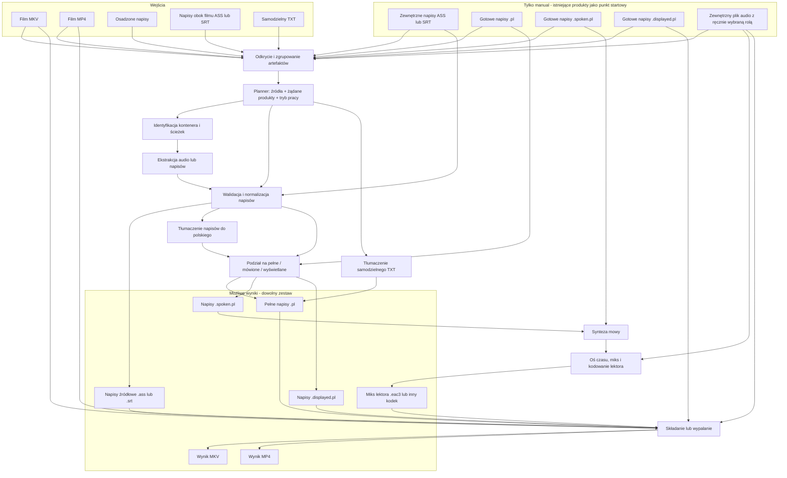

# Etap 9 — model produktu, workflow i ustawień

> Status: wymagania gotowe do końcowej akceptacji. Docelowym interfejsem interaktywnym
> jest TUI; szczegółowy układ ekranów powstanie w planie implementacji.
> Ostatnia aktualizacja: 2026-08-09.
> Szczegółowy kontrakt UI: [etap-9-interfejs-wymagania.md](etap-9-interfejs-wymagania.md).

## 1. Cel etapu

Etap 9 ma zdefiniować, **co AniShift potrafi zrobić**, jak planner ma z tego
zbudować pracę oraz gdzie przebiega granica między TUI i CLI. Szczegółowy wygląd
TUI wynika z tego kontraktu, a nie odwrotnie.

Wymagania mają odpowiedzieć na pięć pytań:

1. Jakie artefakty wejściowe i wyjściowe istnieją?
2. Jakie niezależne decyzje może podjąć użytkownik?
3. Jak planner składa z tych decyzji wykonalny pipeline?
4. Jakie ustawienia są globalne, zależne od silnika, jednorazowe albo wewnętrzne?
5. Jaki interfejs pozwoli obsłużyć ten model bez zapamiętywania wielu komend?

Ten dokument kończy analizę kontraktu produktu i ustawień. Implementacja Etapu 9
obejmuje również TUI, ale dopiero po ustabilizowaniu planera i application API.

## 2. Decyzje już podjęte

Poniższe ustalenia nie wymagają ponownego otwierania podczas dalszej analizy:

- źródłem obrazu może być plik MKV albo MP4;
- napisy mogą być osadzone w kontenerze albo leżeć obok filmu jako plik o tym
  samym rdzeniu nazwy, na przykład `1.mkv` + `1.ass`;
- istniejące polskie produkty zachowują nazwy `.pl`, `.spoken.pl` i
  `.displayed.pl`;
- użytkownik może poprosić o MKV, MP4 albo oba kontenery w jednym uruchomieniu;
- wypalenie napisów jest osobną decyzją; dozwolony jest również obraz bez
  wypalonych napisów;
- każdy serwis przetwarza kompatybilny artefakt i nie zna poprzedniego ani
  następnego kroku;
- planner składa zadania z żądanych produktów oraz dostępnych artefaktów;
- scheduler uruchamia gotowe zadania strumieniowo i współbieżnie tam, gdzie jest
  to bezpieczne;
- głównym interfejsem interaktywnym będzie TUI, a CLI pozostanie cienką warstwą
  automatyzacji i diagnostyki;
- nie projektujemy jeszcze szczegółowego układu ekranów ani skrótów klawiszowych;
- nie tworzymy listy wszystkich kombinacji. Opisujemy niezależne osie decyzji,
  zależności i reguły poprawności.

## 3. Prosty model mentalny

AniShift nie powinien myśleć wyłącznie kategorią „uruchom cały pipeline”.
Powinien myśleć kategorią produktów:

- użytkownik wskazuje, co ma powstać;
- system kataloguje źródła i produkty, ale interpretuje je zgodnie z trybem;
- planner dobiera operacje potrzebne do wskazanego celu oraz punktu startowego;
- scheduler uruchamia operację, gdy wszystkie jej wejścia są gotowe;
- wynik jednego serwisu staje się wejściem kolejnego serwisu;
- w `auto` żądane produkty pochodne powstają od nowa, a w `manual` można użyć
  gotowego produktu jako punktu startowego.

Przykład manualny: żądanie „lektor z gotowych polskich napisów” nie wymaga identyfikacji
ścieżki napisów w MKV, ekstrakcji ani tłumaczenia. Wymaga tylko przygotowania
tekstu mówionego, TTS, złożenia audio i wybranego produktu końcowego.

### 3.1. Cztery warstwy

| Warstwa | Odpowiedzialność | Czego nie robi |
|---|---|---|
| Katalog artefaktów | odkrywa pliki, rozpoznaje ich typ i stan | nie wybiera celu użytkownika |
| Planner | zamienia cel na graf zależności | nie wykonuje FFmpeg, TTS ani tłumaczenia |
| Scheduler | kolejkowanie, współbieżność, retry i izolacja błędów | nie interpretuje ustawień UI |
| Serwis | wykonuje jedną operację na określonych wejściach | nie zna całego pipeline'u |

TUI i CLI są adapterami do tego samego kontraktu. Nie zawierają własnej logiki
pipeline'u.

## 4. Główny przepływ

Poniższy graf pokazuje możliwe wejścia u góry, niezależne operacje pośrodku i
produkty na dole. Nie każda ścieżka musi przejść przez każdy węzeł.



Wynik nie musi zawierać MKV ani MP4. Poprawnym zakończeniem pracy może być
dowolny zestaw plików obok źródła, na przykład tylko:

```text
1.ass
1.pl.ass
1.spoken.pl.ass
1.displayed.pl.ass
1.eac3
```

To jest sens wariantu „players”: odtwarzacz dostaje film oraz wybrane pliki
boczne. Kontener końcowy jest opcjonalnym, niezależnym produktem.

Samodzielny TXT jest zachowaną minifunkcją tłumaczenia tekstu. Tworzy
`<stem>.pl.srt` z techniczną, sekwencyjną osią czasu i nie prowadzi do TTS,
audio ani composition. Nie należy go interpretować jak napisy filmu.

## 5. Artefakty i nazewnictwo

### 5.1. Grupa źródłowa

Film i pliki o zgodnym rdzeniu tworzą jedną grupę źródłową:

```text
1.mkv
1.mp4
1.ass
1.pl.ass
1.spoken.pl.ass
1.displayed.pl.ass
1.eac3
```

Nie każdy plik musi istnieć. Przykład pokazuje wszystkie typy należące do rdzenia
`1`, włącznie z sytuacją, w której MKV i MP4 leżą obok siebie.

Planner działa na grupie, nie na przypadkowej liście ścieżek. Dzięki temu wie,
które artefakty należą do tego samego odcinka.

Pliki w grupie dzielą się na trzy klasy:

- **źródła główne** — `1.mkv`, `1.mp4` albo samodzielny `1.txt`; tworzą grupę
  i są jedynymi automatycznie odkrywanymi zadaniami;
- **artefakty źródłowe grupy filmu** — exact-stem `1.ass`/`1.srt`; nie tworzą
  samodzielnej grupy bez filmu;
- **produkty pochodne** — `1.pl.*`, `1.spoken.pl.*`, `1.displayed.pl.*`,
  `1.eac3`, `1.pl.mkv` i `1.pl.mp4`.

Tryb `auto` tworzy zadanie wyłącznie dla grupy posiadającej źródło główne.
Produkt pochodny nigdy nie staje się osobnym odcinkiem. W `auto` jest poprzednim
wynikiem do zastąpienia, a w `manual` może zostać jawnie wybrany jako punkt
startowy tej samej grupy.

TXT jest samodzielny tylko wtedy, gdy ten sam rdzeń nie należy do MKV ani MP4.
Układ `1.txt` + `1.mkv` albo `1.mp4` jest niejednoznaczny, ponieważ oba zadania
mogłyby zapisać `1.pl.srt`; discovery zgłasza konflikt nazw przed planowaniem.

### 5.2. Obsługiwane wejścia

| Artefakt | Stan dzisiaj | Wymaganie Etapu 9 |
|---|---|---|
| `*.mkv` | obsługiwany | zachować pełną obsługę |
| `*.mp4` | nie jest odkrywany przez pipeline | dodać jako równorzędne źródło obrazu |
| osadzone napisy w MKV | obsługiwane | zachować |
| osadzone napisy w MP4 | brak ścieżki ekstrakcji | rozpoznawać przez ffprobe i wyciągać przez FFmpeg |
| `<stem>.ass` / `<stem>.srt` | nie są pełnoprawnym wejściem głównego pipeline'u | traktować jako napisy źródłowe obok filmu |
| zewnętrzny ASS/SRT o innym rdzeniu | brak pełnego kontraktu | tylko `manual`: użytkownik wskazuje plik jako źródło napisów konkretnej grupy |
| `<stem>.pl.ass` / `.srt` | częściowo używane przy ponownym składaniu | produkt grupy; w `auto` jest celem do zastąpienia, w `manual` może być wejściem |
| `<stem>.spoken.pl.*` | trwały produkt | w `auto` jest celem do zastąpienia, w `manual` może być wejściem TTS |
| `<stem>.displayed.pl.*` | trwały produkt | w `auto` jest celem do zastąpienia, w `manual` może być wejściem składu |
| `<stem>.<kodek audio>` | częściowo wykrywany przez compose-only | produkty AniShift mają rozszerzenia `.eac3`, `.m4a`, `.mp3`, `.opus`, `.flac` albo `.wav`; w `auto` są celem do zastąpienia, w `manual` mogą być wejściem składu |
| zewnętrzny plik audio | brak pełnego kontraktu | tylko `manual`: użytkownik wskazuje plik i jego rolę; akceptacja zależy od poprawnego probe i dekodowania przez FFmpeg, nie od samego rozszerzenia |
| `*.txt` | obsługiwany jako wejście tłumaczenia | zachować jako niezależną minifunkcję tworzącą `<stem>.pl.srt`, bez TTS i operacji multimedialnych |

Obsługiwane formaty napisów na tym etapie pozostają ograniczone do ASS i SRT.

### 5.3. Granica MKV i MP4

MKVToolNix przyjmuje MP4 jako źródło przy tworzeniu MKV, ale `mkvextract`
wydobywa ścieżki wyłącznie z kontenerów Matroska. Z tego wynikają dwa adaptery:

- MKV: identyfikacja przez `mkvmerge`, ekstrakcja przez `mkvextract`;
- MP4: identyfikacja przez `ffprobe`, ekstrakcja przez FFmpeg.

Oba adaptery muszą zwracać ten sam neutralny opis ścieżek. Reszta pipeline'u nie
może rozpoznawać, z którego kontenera pochodzi audio albo plik napisów.

### 5.4. Trwałe produkty

| Produkt | Nazwa |
|---|---|
| pełne polskie napisy | `<stem>.pl.ass` albo `<stem>.pl.srt` |
| kwestie do przeczytania | `<stem>.spoken.pl.ass` albo `.srt` |
| napisy pozostawione na ekranie | `<stem>.displayed.pl.ass` albo `.srt` |
| gotowy miks lektora | `<stem>.<kodek>`, na przykład `<stem>.eac3` |
| kontener MKV | `<stem>.pl.mkv` |
| kontener MP4 | `<stem>.pl.mp4` |

Źródło nie może zostać nadpisane. Wielokrotne uruchomienie nie może przypadkiem
potraktować własnego `.pl.mkv` albo `.pl.mp4` jako nowego źródła.

Jeżeli źródłem są osadzone napisy, ich trwałym produktem jest zwykły
`<stem>.ass` albo `<stem>.srt`. Nie wprowadzamy dodatkowego sufiksu `.source`.
Jeżeli wybranym źródłem jest już exact-stem sidecar, żądanie `source_subtitles`
jest spełnione przez ten plik i nie tworzy kopii ani nie nadpisuje źródła.

## 6. Dwie osobne klasy stanów

Dotychczasowe opisy mieszały stan pliku ze stanem zadania. Etap 9 rozdziela te
pojęcia.

### 6.1. Stan artefaktu

| Stan | Znaczenie |
|---|---|
| `missing` | artefakt nie istnieje |
| `candidate` | plik został znaleziony, ale nie przeszedł walidacji |
| `ready` | plik istnieje, jest poprawny i może być użyty |
| `invalid` | plik istnieje, ale jest uszkodzony lub niezgodny z kontraktem |

`ready` nie oznacza tylko „ścieżka istnieje”. Plik musi przejść walidację swojego
formatu. Jeżeli AniShift posiada manifest z odciskiem wejścia, może sprawdzić go
dodatkowo, ale brak manifestu nie dyskwalifikuje pliku dostarczonego przez
użytkownika.

### 6.2. Stan zadania

| Stan | Znaczenie |
|---|---|
| `blocked` | brakuje co najmniej jednego wymaganego wejścia |
| `ready` | wszystkie wejścia są gotowe |
| `queued` | zadanie czeka na zasób albo limit współbieżności |
| `running` | serwis wykonuje operację |
| `succeeded` | zadanie utworzyło i zwalidowało wynik |
| `failed` | wykonanie zakończyło się błędem |
| `cancelled` | użytkownik albo proces nadrzędny anulował zadanie |

W `manual` wskazany artefakt `ready` usuwa z planu zadanie, które miałoby go
wyprodukować. W `auto` istniejący produkt pochodny nie usuwa zadania: żądany
produkt pochodny powstaje od nowa. Nie potrzebujemy osobnych stanów `reused`, `skipped` ani
`not_requested`. Stan pliku nie powinien być zakodowany w stanie całego odcinka.

## 7. Niezależne decyzje użytkownika

Poniższe pola opisują zamiar. Nie są jeszcze komendami ani kontrolkami.

### 7.1. Żądane produkty

`requested_products` jest jednym zbiorem zawierającym dowolne pozycje:

- `source_subtitles` — `<stem>.ass` albo `<stem>.srt`;
- `full_pl` — `<stem>.pl.ass` albo `.srt`;
- `spoken_pl` — `<stem>.spoken.pl.ass` albo `.srt`;
- `displayed_pl` — `<stem>.displayed.pl.ass` albo `.srt`;
- `narration_audio` — gotowy miks oryginału i lektora, na przykład `.eac3`;
- `mkv` — `<stem>.pl.mkv`;
- `mp4` — `<stem>.pl.mp4`.

Zestaw bez `mkv` i `mp4` jest pełnoprawnym wynikiem. `sidecar` oznacza kategorię
pliku leżącego obok filmu, a nie osobny etap ani obowiązkowy wariant końcowy.

Planner może utworzyć produkt pośredni, nawet jeśli użytkownik nie chce zachować
go po zakończeniu. Przykład: TTS wymaga napisów mówionych, ale `spoken_pl` nie
musi zostać trwałym wynikiem.

`source_subtitles` zachowuje źródło, a nie „regeneruje” je. Dla napisów
osadzonych oznacza ekstrakcję do pliku obok filmu. Dla wybranego exact-stem
sidecara oznacza pozostawienie istniejącego źródła bez zmian. Dla zewnętrznego
ASS/SRT o innej nazwie oznacza atomową publikację kopii pod rdzeniem filmu;
oryginalny plik zewnętrzny pozostaje bez zmian. Bez żądania `source_subtitles`
zewnętrzny plik może zostać użyty bez tworzenia tej kopii.

### 7.2. Automatyczny i ręczny wybór wejścia

Obecny `mode` zostaje, lecz jego znaczenie musi być precyzyjne:

| Tryb | Zachowanie |
|---|---|
| `auto` | tworzy jedną pracę per źródło główne i buduje żądane produkty pochodne od nowa |
| `manual` | pokazuje źródła i produkty grupy oraz pozwala wskazać kompatybilny punkt startowy |

Tryb ręczny jest potrzebny między innymi wtedy, gdy film posiada japoński i
chiński dubbing albo użytkownik chce tłumaczyć francuską ścieżkę napisów zamiast
angielskiej.

W `auto` brak języka z listy priorytetów nie kończy pracy od razu. Planner wybiera
domyślną ścieżkę kontenera, a następnie pierwszą kompatybilną ścieżkę. W planie
wynikowym jawnie pokazuje dokonany wybór.

`manual` nie udostępnia surowych przełączników etapów typu „włącz TTS” albo
„pomiń split”. Użytkownik określa zamiar:

- źródłowy film, napisy i audio;
- czy tłumaczyć wybrane napisy;
- które produkty mają powstać;
- które napisy wypalić lub dołączyć;
- czy użyć istniejącego produktu jako punktu startowego.

Planner sam wyprowadza potrzebne kroki i nie pozwala utworzyć niewykonalnej
kombinacji, na przykład TTS bez tekstu mówionego.

Tryby mają różne modele sterowania:

- `auto` — użytkownik wybiera jeden preset dla grup aktualnie zaznaczonych w Workspace;
- `manual` — użytkownik tworzy niezależny zamiar dla każdej grupy plików;
- skopiowanie manualnego zamiaru na kilka zaznaczonych grup może być wygodnym
  skrótem, ale tworzy osobne jawne plany i nie wprowadza dziedziczenia presetów.

Paczka `auto` oznacza grupy aktualnie zaznaczone na ekranie Workspace; domyślnie
zaznaczone są wszystkie poprawnie wykryte grupy. Jeden preset obowiązuje cały ten
zbiór bez wyjątków per grupa. Odznaczenie grupy usuwa ją z bieżącego uruchomienia,
nie zmieniając jej artefaktów ani zamiaru pozostałych grup.

### 7.3. Wybór źródła napisów

`subtitle_source_policy`:

| Wartość | Znaczenie |
|---|---|
| `auto` | wybierz według reguł poniżej |
| `sidecar` | użyj `<stem>.ass` albo `<stem>.srt` |
| `embedded` | użyj wybranej ścieżki z kontenera |
| `external` | tylko `manual`: użyj jawnie wskazanego ASS/SRT o dowolnej nazwie |
| `ready_polish` | tylko `manual`: użyj `<stem>.pl.ass` albo `.srt` |
| `none` | nie używaj napisów jako wejścia |

Kolejność automatyczna:

1. exact-stem sidecar `1.ass` albo `1.srt`;
2. osadzona ścieżka według `subtitle_language_priority`;
3. domyślna, a następnie pierwsza kompatybilna ścieżka napisów.

Sidecar ma pierwszeństwo przed osadzonymi napisami, nawet jeżeli kontener posiada
polską ścieżkę. To jawny plik położony obok filmu przez użytkownika.

Jeżeli istnieją jednocześnie `1.ass` i `1.srt`, tryb `auto` wybiera ASS, ponieważ
zachowuje style i pozycjonowanie. Tryb `manual` pozwala wybrać SRT. Wybór jest
widoczny w planie, a uszkodzony ASS nie blokuje użycia poprawnego SRT.

### 7.4. Język i tłumaczenie napisów

AniShift nie próbuje zgadywać języka na podstawie treści:

- `.pl.ass` lub `.pl.srt` oznacza gotowe polskie napisy;
- język osadzonej ścieżki pochodzi z metadanych kontenera, ale można go nadpisać;
- `1.ass` albo `1.srt` bez kodu języka jest traktowany jako tekst źródłowy;
- gdy żądany jest polski produkt, nieoznaczony sidecar jest domyślnie tłumaczony;
- jeżeli nieoznaczony sidecar jest już polski, użytkownik może ustawić język
  źródła na `pol` albo wybrać `do_not_translate`;
- nazwa `.pl` zmienia plik w produkt pochodny, więc może być punktem startowym
  tylko w `manual`.

`translation_action` ma tylko trzy wartości:

| Wartość | Znaczenie |
|---|---|
| `auto` | tłumacz, gdy polski produkt jest potrzebny i wybrane źródło nie jest oznaczone ani zadeklarowane jako polskie |
| `translate` | wymagaj przejścia wybranego źródła przez tłumaczenie |
| `do_not_translate` | zachowaj wybrany tekst bez tłumaczenia |

`translation_action=translate` zawsze wymaga napisów źródłowych bez znacznika
`.pl`. Gotowy `1.pl.srt` nie jest ponownie tłumaczony. Aby zbudować polski
produkt od nowa, planner musi mieć osobne napisy źródłowe, na przykład `1.srt`
albo ścieżkę osadzoną.

`translation_action=do_not_translate` może prowadzić do produktu `.pl` tylko wtedy,
gdy język wybranego źródła został oznaczony albo jawnie zadeklarowany jako `pol`.
Dla źródła obcego albo o nieustalonym języku planner pozwala zachować lub wypalić
`source_subtitles`, lecz odrzuca żądanie produktu `.pl` zamiast nadawać mu fałszywe
oznaczenie języka.

### 7.5. Nazwane reguły automatycznego rozstrzygania

Poniższe reguły są źródłem prawdy dla discovery i planera:

| Identyfikator | Reguła |
|---|---|
| `PRIMARY_SOURCE_ONLY` | `auto` rozpoczyna pracę tylko od MKV, MP4 albo TXT; sam sidecar nie tworzy grupy |
| `AUTO_REBUILDS_PRODUCTS` | `auto` ignoruje produkty pochodne jako wejścia i atomowo zastępuje żądane produkty pochodne |
| `SOURCE_SUBTITLES_ARE_SOURCE` | exact-stem sidecar spełnia żądanie `source_subtitles` bez kopiowania i nigdy nie jest nadpisywany |
| `SOURCE_PATH_COLLISION` | ekstrakcja osadzonych napisów nie może zastąpić istniejącego exact-stem sidecara; planner zgłasza konflikt albo użytkownik rezygnuje z trwałej ekstrakcji |
| `TXT_STANDALONE` | TXT z rdzeniem zajętym przez MKV lub MP4 jest konfliktem discovery, a nie drugim zadaniem |
| `MANUAL_PRODUCT_INPUT` | tylko `manual` może użyć napisów `.pl`, `.spoken.pl`, `.displayed.pl` albo audio jako punktu startowego |
| `MANUAL_EXTERNAL_SUBTITLE` | `manual` może przypisać dowolny poprawny ASS/SRT jako źródło napisów grupy; produkty zachowują rdzeń filmu, nie zewnętrznego pliku, a oryginał nie jest modyfikowany |
| `MANUAL_EXTERNAL_AUDIO` | `manual` może wskazać zewnętrzny plik audio i określić rolę `source_audio` albo `narration_mix` |
| `POLISH_MARKER` | znacznik `.pl` oznacza polski produkt, nigdy surowe źródło do tłumaczenia |
| `POLISH_SOURCE_BYPASS` | źródłowe napisy zadeklarowane jako `pol` pomijają tłumaczenie i przechodzą do splitu |
| `UNMARKED_IS_SOURCE` | `1.ass` i `1.srt` są napisami źródłowymi; gdy potrzebny jest polski produkt, podlegają tłumaczeniu |
| `FINAL_CONTAINER_NOT_INPUT` | `.pl.mkv` i `.pl.mp4` nigdy nie są źródłem nowej grupy ani punktem startowym `manual` |
| `SIDECAR_FIRST` | exact-stem sidecar ma pierwszeństwo przed napisami osadzonymi |
| `ASS_FIRST` | gdy istnieją `1.ass` i `1.srt`, `auto` wybiera ASS |
| `MKV_FIRST` | gdy istnieją `1.mkv` i `1.mp4`, `auto` wybiera MKV jako źródło grupy |
| `MANUAL_OVERRIDE` | wybór użytkownika w `manual` ma pierwszeństwo przed wszystkimi regułami automatycznymi |
| `INTENT_NOT_STAGES` | `manual` wybiera źródła, działania i produkty; planner wyprowadza etapy pipeline'u |
| `AUTO_PRESET_BATCH` | jeden preset `auto` określa ten sam cel dla całej aktualnie zaznaczonej paczki |
| `MANUAL_PER_GROUP` | każda grupa w `manual` ma własny jawny punkt startowy, działania i produkty |
| `VISIBLE_AUTO_DECISION` | plan pokazuje wybrane źródło i pominięte alternatywy przed rozpoczęciem płatnej pracy |

Przykład automatycznego przebudowania produktów:

```text
1.mkv                 źródło główne i jedyne zadanie auto
1.pl.srt              poprzedni produkt - zostanie atomowo zastąpiony
1.spoken.pl.srt       poprzedni produkt - zostanie atomowo zastąpiony
1.eac3                poprzedni produkt - zostanie atomowo zastąpiony
```

AniShift nie uruchamia czterech osobnych prac. Buduje jeden świeży plan dla
`1.mkv`. W `manual` użytkownik może zamiast tego zacząć od wybranego produktu.

Jeżeli grupa zawiera tylko `1.mkv` oraz `1.pl.srt`, tryb `auto` nadal nie używa
`.pl.srt` jako wejścia. Korzysta z napisów osadzonych albo zgłasza brak źródła.
Użycie gotowego `1.pl.srt` do lektora wymaga wybrania tej grupy w `manual`.

### 7.6. Lektor

Lektor nie potrzebuje osobnej pięciostanowej polityki. Wystarczają dwie decyzje:

| Decyzja | Znaczenie |
|---|---|
| `narration_audio` w `requested_products` | lektor ma zostać opublikowany jako trwały sidecar obok filmu |
| kontener żąda ścieżki narration, ale `narration_audio` nie jest produktem | lektor powstaje wyłącznie jako tymczasowa zależność composition |
| brak zapotrzebowania na lektora | TTS i miks nie trafiają do planu |

W `auto` istniejący `<stem>.<kodek>` nie pomija TTS i miksu: żądany lektor
powstaje od nowa. W `manual` AniShift może sprawdzić plik przez ffprobe i użyć go
jako gotowego miksu. Nie da się automatycznie udowodnić, że obcy plik audio
zawiera właściwy głos i właściwy odcinek; ręczny wybór jest deklaracją
użytkownika.

W `manual` można też wskazać dowolny obsługiwany plik audio spoza grupy. Użytkownik
określa jego rolę:

- `source_audio` — źródłowa ścieżka do miksu zamiast audio osadzonego w filmie;
- `narration_mix` — gotowa ścieżka odsłuchowa kierowana bezpośrednio do
  composition.

FFprobe musi potwierdzić poprawny strumień audio, a pełne dekodowanie przez FFmpeg
nie może zgłosić błędu. Różnica czasu trwania względem filmu może wynosić najwyżej
1 sekundę. Etap 9 nie dodaje ręcznego przesunięcia ani rozciągania zewnętrznej
ścieżki.

Jeżeli lektora brakuje, planner tworzy `spoken_pl` → TTS → miks → kodowanie.

### 7.7. Napisy wypalone w obrazie MP4

`burn_subtitle_product`:

| Wartość | Znaczenie |
|---|---|
| `none` | MP4 bez wypalonych napisów |
| `source` | wypal wybrane napisy źródłowe |
| `full_pl` | wypal pełne polskie napisy |
| `displayed_pl` | wypal tylko elementy pozostawione przy lektorze |

Wartość nie jest automatycznie związana z obecnością lektora. Użytkownik może
utworzyć MP4 z lektorem i pełnymi napisami, z lektorem i napisami pobocznymi albo
bez żadnych wypalonych napisów.

### 7.8. Ścieżki dołączone do MKV

`mkv_tracks` jest zbiorem:

- `source_subtitles`;
- `full_pl_subtitles`;
- `displayed_pl_subtitles`;
- `narration_audio`.

Planner odrzuca wybór ścieżki, której nie można uzyskać z dostępnych wejść i
pozostałych decyzji.

Composition produkuje wyłącznie kontenery MKV albo MP4. Trwałe sidecary publikuje
application layer atomowo z wyniku właściwego producenta: ekstrakcji, splitu albo
audio. Dzięki temu composition nie staje się właścicielem produktów, których nie
tworzy.

### 7.9. Tryb pracy, retry i fallback

To są trzy różne mechanizmy:

| Mechanizm | Kiedy działa | Przykład |
|---|---|---|
| `auto` | buduje wszystkie żądane produkty pochodne od nowa | zastąp `.pl`, `spoken.pl` i `.eac3` |
| wybór manualny | używa wskazanego istniejącego produktu | rozpocznij od `1.spoken.pl.srt` |
| retry | zadanie chwilowo nie powiodło się | powtórz timeout tego samego silnika |
| fallback | wybrany silnik nie może dokończyć pracy | po wyczerpaniu retry przejdź z Google na DeepL |

Nie istnieje osobne ustawienie `regenerate` ani `rebuild_products`. Wybór `auto`
oznacza świeże wykonanie, a `manual` pozwala wskazać gotowy punkt startowy.

Nowy plik w `auto` najpierw powstaje tymczasowo i przechodzi walidację. Dopiero
potem atomowo zastępuje poprzedni produkt. Nie kasujemy działającego wyniku przed
udaną pracą.

## 8. Reguły planowania

Planner musi być deterministyczny: te same wejścia, ustawienia i cele tworzą ten
sam graf.

1. Najpierw waliduje grupę źródłową i rozpoznaje wszystkie warianty wejścia.
2. Następnie rozwiązuje żądane produkty na wymagane artefakty.
3. W `auto` dla każdego żądanego produktu pochodnego wybiera operację, która
   utworzy go od nowa. W `manual` może rozpocząć od wskazanego gotowego produktu.
4. Przed płatnym TTS lub tłumaczeniem sprawdza, czy cały plan jest wykonalny.
5. Nie uruchamia serwisu, którego wynik nie jest wymagany bezpośrednio ani jako
   zależność.
6. Nie wykonuje tłumaczenia przy `do_not_translate`.
7. Nie wymaga napisów do przepakowania filmu bez napisów i bez lektora.
8. Tylko `manual` może pominąć tłumaczenie lub split dzięki gotowemu `.pl` albo
   `spoken.pl`.
9. Może użyć jednego artefaktu w wielu produktach końcowych, na przykład tego
   samego lektora w MKV i MP4.
10. Błąd planu jest zgłaszany przed rozpoczęciem wykonania i wskazuje brakujący
    artefakt albo sprzeczną decyzję.
11. Gdy istnieją `1.mkv` i `1.mp4`, `auto` wybiera MKV. Nie porównuje materiału
    ani nie uruchamia osobnego zadania dla MP4.
12. Jeśli oba filmy mają zostać przetworzone niezależnie, muszą posiadać różne
    rdzenie nazw. W `manual` użytkownik może zamiast MKV wybrać MP4.

## 9. Reprezentatywne ścieżki

To nie jest lista wszystkich kombinacji. Scenariusze sprawdzają, czy niezależne
decyzje składają się poprawnie.

| Wejście | Zamiar | Wymagana ścieżka |
|---|---|---|
| MKV z obcymi napisami | polskie napisy + MP4 | identyfikacja → ekstrakcja → tłumaczenie → wypalenie |
| MKV z obcymi napisami | zachowaj oryginał i wypal go | identyfikacja → ekstrakcja → wypalenie, bez tłumaczenia |
| MP4 + `1.ass` | tłumaczenie + lektor + MKV | sidecar → tłumaczenie → split → TTS → miks → mux MKV |
| MP4 + `1.pl.srt`, manual | tylko lektor audio | split → TTS → miks, bez ekstrakcji i tłumaczenia |
| MKV + `1.ass` | tylko pliki players | source → full/spoken/displayed → lektor, bez composition |
| MKV + gotowy `spoken.pl`, manual | lektor + MKV i MP4 | TTS → miks → dwa zadania composition |
| MKV + gotowy lektor, manual | MKV i MP4 | dwa zadania composition, bez TTS |
| MKV + zewnętrzny FLAC, manual | FLAC jako `source_audio` | TTS → miks z FLAC → wybrane produkty |
| MKV + zewnętrzny ASS o innym rdzeniu, manual | użyj ASS jako źródła | walidacja → opcjonalne tłumaczenie → wybrane produkty o rdzeniu MKV |
| MKV bez napisów | przepakuj do MP4 bez napisów | composition, bez tłumaczenia i TTS |
| TXT | polskie tłumaczenie | tłumaczenie tekstu, bez operacji multimedialnych |
| wiele odcinków | pełny pipeline | gotowe artefakty przepływają między kolejkami bez bariery całego etapu |
| `1.mkv` + `1.mp4` | automatyczny pipeline | jedna grupa i jedno zadanie; MKV jako źródło, MP4 pominięte |
| `1.ass` + `1.srt` | automatyczny pipeline | ASS; SRT pozostaje dostępny do ręcznego wyboru |

## 10. Kontrakty serwisów

| Serwis | Przyjmuje | Zwraca |
|---|---|---|
| discovery | katalog i reguły nazw | grupy źródłowe oraz kandydatów artefaktów |
| media probe | MKV albo MP4 | neutralny katalog ścieżek audio, wideo i napisów |
| extraction | kontener + wybrane ścieżki | audio albo napisy w obsługiwanym formacie |
| subtitle normalization | ASS/SRT | zwalidowany dokument napisów |
| standalone text translation | TXT | `<stem>.pl.srt` z techniczną osią czasu |
| classifier/split | dokument napisów | pełne, mówione i wyświetlane segmenty |
| translation | tekst źródłowy + konfiguracja silnika | przetłumaczony tekst w tej samej strukturze |
| TTS | neutralne żądania mowy | klipy audio z tożsamością i metadanymi |
| audio | klipy + źródłowe audio + ustawienia miksu | gotowy lektor w wybranym kodeku |
| composition | źródłowy film + opcjonalne audio/napisy + specyfikacja wyjścia | wyłącznie kontener MKV albo MP4; sidecary publikuje warstwa aplikacyjna |

Serwis nie odczytuje globalnego `UserSettings`. Otrzymuje zwalidowany, minimalny
kontrakt potrzebny do konkretnego zadania. Dzięki temu jego zachowanie można
testować niezależnie od CLI i TUI.

## 11. Kolejki, asynchroniczność i współbieżność

### 11.1. Zasada gotowości

Zadanie trafia do kolejki serwisu natychmiast po uzyskaniu wszystkich wejść. Nie
czeka, aż poprzedni „etap” zakończy się dla wszystkich odcinków.

Przykład:

```text
odcinek 1: tłumaczenie ──> TTS ──> audio ──> composition
odcinek 2:      tłumaczenie ──> TTS ──> audio ──> composition
odcinek 3:           ekstrakcja ──> tłumaczenie ──> TTS
```

### 11.2. Granice współbieżności

- limity są osobne dla ekstrakcji, tłumaczenia, każdego dostawcy TTS, audio i
  composition;
- silnik może ograniczyć własną współbieżność, na przykład SAPI do jednego
  procesu;
- jedna awaria odcinka nie zatrzymuje niezależnych odcinków;
- `ready_first` maksymalizuje przepustowość;
- `strict_natural` zachowuje naturalną kolejność publikacji, ale nie powinien
  wyłączać bezpiecznej pracy w tle;
- retry dotyczy konkretnego zadania i błędów przejściowych, nie całego pipeline'u;
- częściowy sukces pozostaje widoczny; trwały produkt może zostać ręcznie
  wybrany jako punkt wznowienia.

`strict_natural` blokuje przekazanie lub publikację wyniku za wcześniejszą,
nierozstrzygniętą grupą w tej samej kolejce. Nie blokuje discovery, probe,
ekstrakcji ani innych bezpiecznych operacji w tle. Wcześniejsza grupa musi zostać
rozstrzygnięta jako sukces, błąd, pominięcie albo anulowanie, zanim późniejszy wynik
przejdzie przez bramkę kolejności.

### 11.3. Sprzątanie plików tymczasowych

- każde źródło posiada własny katalog roboczy w `workspace/temp/<scope>`;
- pliki trwałe są publikowane obok źródła;
- po zakończeniu, błędzie albo anulowaniu procesu AniShift usuwa wszystkie
  należące do niego pliki tymczasowe;
- sprzątanie działa w `finally`, więc nie zależy od sukcesu całego odcinka;
- działający proces nie usuwa katalogu używanego przez inny proces;
- mechanizm resume nie może wymagać pozostawiania nieograniczonej liczby plików
  w `workspace/temp`;
- brak możliwości usunięcia jest raportowany, a następne uruchomienie wykonuje
  bezpieczne sprzątanie osieroconych katalogów.

## 12. Model ustawień

Każde ustawienie musi posiadać metadane niezależne od interfejsu:

- stabilny identyfikator;
- typ, dozwolone wartości i zakres;
- wartość domyślną;
- zakres obowiązywania;
- informację, od którego silnika albo produktu zależy;
- sposób walidacji;
- informację, czy zmiana unieważnia istniejący artefakt;
- opis bezpieczny do pokazania użytkownikowi;
- informację, czy wartość jest sekretem.

### 12.1. Zakresy ustawień

| Zakres | Przykład | Trwałość |
|---|---|---|
| globalne | kolejność przetwarzania | zapisane w konfiguracji |
| profil silnika | głos i tempo konkretnego głosu TTS | zapisane per silnik i głos |
| preset `auto` | tłumacz i utwórz lektora dla całej aktualnie zaznaczonej paczki | zapisany albo jednorazowy wybór uruchomienia |
| plan `manual` | ręcznie wybrane źródła i produkty jednej grupy | obowiązuje jedną grupę w bieżącym uruchomieniu |
| sekret | klucz API | środowisko lub bezpieczny magazyn, nie zwykły preset |
| wewnętrzne | limit bajtów żądania dostawcy | nie jest ustawieniem użytkownika |

Preset `auto` nie jest dziedziczony przez plan `manual`. Oba korzystają ze
wspólnych globalnych profili silników, ale opisują inny sposób uruchomienia.

## 13. Pełny katalog ustawień

Legenda stanu:

- **obecne** — działa i jest zapisane;
- **ukryte** — działa w modelu konfiguracji, ale nie jest dostępne w panelu;
- **stałe** — kod ma tylko jedną zaimplementowaną wartość;
- **nowe** — wymagane przez model Etapu 9;
- **naprawić** — pole istnieje, ale jego kontrakt nie jest rzeczywiście wykonany.

### 13.1. Workflow i wybór wejścia

| Ustawienie | Stan | Zakres | Wymaganie |
|---|---|---|---|
| `mode` (`auto`/`manual`) | obecne | wybór uruchomienia | przenieść z trwałej konfiguracji do wyboru workflow; można zapamiętać ostatnią wartość wyłącznie jako wygodę |
| `schema_version` | obecne | wewnętrzne | wersjonuje zapis konfiguracji; nie jest ustawieniem wybieranym przez użytkownika |
| `processing_order_policy` | obecne | globalne | `ready_first` albo `strict_natural` |
| `subtitle_source_policy` | nowe | preset `auto`/grupa `manual` | `auto`, `sidecar`, `embedded`, `external`, `ready_polish`, `none`; `external` i `ready_polish` tylko manual |
| `selected_audio_track` | nowe | grupa `manual` | ręczny override automatycznego wyboru |
| `selected_subtitle_track` | nowe | grupa `manual` | ręczny override automatycznego wyboru |
| `preferred_video_source` | nowe | grupa `manual` | ręczny wybór MKV albo MP4, gdy oba mają ten sam rdzeń |
| `source_subtitle_language` | nowe | preset `auto`/grupa `manual` | override metadanych lub nieoznaczonego sidecara, np. `pol`, `eng`, `fra`; w `auto` dotyczy całej aktualnie zaznaczonej paczki |
| `selected_external_subtitle` | nowe | grupa `manual` | jawna ścieżka ASS/SRT przypisana do wybranego filmu; nie zmienia rdzenia nazw produktów |
| `selected_external_audio` | nowe | grupa `manual` | jawna ścieżka zewnętrznego audio |
| `external_audio_role` | nowe | grupa `manual` | `source_audio` albo `narration_mix` |
| `subtitle_output_format` | nowe | preset `auto`/grupa `manual` | `preserve`, `ass` albo `srt`; domyślnie `preserve` |
| `audio_language_priority` | obecne | globalne | uporządkowana lista języków audio |
| `subtitle_language_priority` | obecne | globalne | uporządkowana lista języków napisów |
| `translation_action` | nowe | preset `auto`/grupa `manual` | `auto`, `translate` albo `do_not_translate` |
| `requested_products` | nowe | preset `auto`/grupa `manual` | jeden zbiór sidecarów, lektora, MKV i MP4 |

### 13.2. Tłumaczenie wspólne

| Ustawienie | Stan | Wymaganie |
|---|---|---|
| `translation_engine` | obecne | `google`, `deepl` albo `llm` |
| `translation_fallback_chain` | ukryte | edytowalna uporządkowana lista silników bez duplikatów |
| `translation_batch_size` | ukryte | zakres 0–500; `0` oznacza domyślną wartość silnika |
| `translation_concurrency` | naprawić | zaimplementować rzeczywisty limit 1–16; pole nie może pozostać martwe |
| `translation_max_retries` | obecne | zakres 0–10 dla błędów przejściowych |
| język źródłowy | częściowo stałe | `auto` domyślnie, opcjonalny override użytkownika |
| język docelowy | stałe | polski w zakresie AniShift; nie wymaga ogólnego selektora języka |

Limity protokołu dostawcy, takie jak maksymalna liczba bajtów żądania, pozostają
wewnętrzne i nie trafiają do zwykłych ustawień.

### 13.3. LLM

| Ustawienie | Stan | Wymaganie |
|---|---|---|
| `llm_provider` | obecne | Anthropic, DeepSeek, Gemini, OpenAI, OpenAI-compatible albo OpenRouter |
| `llm_provider_model_id` | obecne | dowolny zwalidowany identyfikator modelu |
| `llm_temperature` | ukryte | opcjonalne, zakres 0–2 |
| `llm_top_p` | ukryte | opcjonalne, zakres 0–1 |
| `llm_max_output_tokens` | ukryte | opcjonalny limit 1–32 000 |
| `llm_prompt_id` | obecne | wybór promptu zadania |
| `llm_style_id` | obecne | wybór stylu tłumaczenia |
| `llm_module_ids` | obecne | zbiór dodatkowych modułów promptu |
| `llm_max_concurrency` | obecne | zakres 1–4 równolegle tłumaczonych plików |
| timeout dostawcy | wewnętrzne | nie wystawiać bez konkretnego przypadku użytkownika |

Każdy provider ma własny klucz API. Provider OpenAI-compatible posiada również
konfigurowalny bazowy URL.

### 13.4. TTS wspólne

| Ustawienie | Stan | Zakres |
|---|---|---|
| `tts_engine` | obecne | `edge`, `elevenbytes`, `elevenlabs`, `sapi` |
| `tts_provider_model_id` | obecne | per silnik |
| `tts_voice_id` | obecne | per silnik |
| `tts_max_retries` | obecne | zakres 0–10, walidowany per provider |
| `postprocess_tempo` | obecne | zakres 0,5–2,0; profil silnik + głos |
| `voice_mix_offset_db` | obecne | profil silnik + głos |
| `concurrency` | obecne | zakres zapisu 1–100; silnik może narzucić niższe maksimum |
| `native_rate` | obecne warunkowo | tylko silniki, które to obsługują |
| `native_volume` | obecne warunkowo | tylko silniki, które to obsługują |
| `native_pitch` | obecne warunkowo | tylko silniki, które to obsługują |
| `engine_options` | obecne | typowany schemat zależny od silnika i modelu |
| resume TTS | stałe | wznawia pracę w aktywnym uruchomieniu; wznowienie od trwałego produktu jest wyborem `manual` |
| artefakty debug/resume | stałe | manifesty i klipy są kontraktem technicznym, nie zwykłą opcją użytkownika |

Ustawienie nieobsługiwane przez wybrany silnik znika z aktywnego schematu zamiast
pozostawać jako pole bez efektu.

### 13.5. Edge TTS

| Ustawienie | Wymaganie |
|---|---|
| model | obecnie stały `edge-default` |
| głos | wbudowane głosy Marek i Zofia oraz przyszłe głosy z rejestru |
| native rate | zapis `-100%`–`+100%` |
| native volume | zapis `-100%`–`+100%` |
| native pitch | zapis `-100Hz`–`+100Hz` |
| concurrency | edytowalne do limitu adaptera |
| postprocess tempo | per głos |
| voice mix offset | per głos |

### 13.6. ElevenBytes

| Ustawienie | Wymaganie |
|---|---|
| endpoint/model | `run6` albo `run7` |
| głos | Dallin albo własny alias powiązany z `voice_id` |
| własne głosy | lista: alias, etykieta, identyfikator providera |
| VPN routing | włączone/wyłączone |
| concurrency | per głos, z walidacją zależną od routingu i endpointu |
| stability | zakres 0–1, tylko `run7` |
| similarity boost | zakres 0–1, tylko `run7` |
| style | zakres 0–1, tylko `run7` |
| speaker boost | tylko model, który obsługuje tę opcję |
| postprocess tempo | per głos |
| voice mix offset | per głos |

Opcje modelu `run7` nie mogą być zachowywane jako aktywne ustawienia `run6`.

### 13.7. Oficjalny ElevenLabs

| Ustawienie | Wymaganie |
|---|---|
| API key | sekret |
| model | identyfikator modelu providera |
| voice | identyfikator głosu providera |
| native output format | wartość obsługiwana przez provider |
| stability | zakres 0–1, per profil |
| similarity boost | zakres 0–1, per profil |
| style | zakres 0–1, per profil |
| speaker boost | per profil |
| native speed | zakres 0,7–1,2 |
| concurrency i retries | edytowalne w limitach providera |
| postprocess tempo i voice mix offset | per głos |

### 13.8. SAPI

| Ustawienie | Wymaganie |
|---|---|
| host/architektura | zgodna z wybranym głosem, na przykład x86 albo x64 |
| głos | Agnieszka x86, Zosia x64 lub wykryty kompatybilny profil |
| native rate | Agnieszka: liczba całkowita od -10 do 10; Zosia: dodatnie WPM |
| native volume | Agnieszka: liczba całkowita 0–100; Zosia: 0–1 |
| concurrency | stałe `1`; nie pokazywać fałszywej możliwości zwiększenia |
| pitch | brak, dopóki adapter go rzeczywiście nie obsługuje |
| postprocess tempo i voice mix offset | per głos |

### 13.9. Audio i miks

| Ustawienie | Stan | Wymaganie |
|---|---|---|
| `tts_output_profile` | obecne | AAC, EAC3, FLAC, MP3, Opus albo WAV |
| `tts_output_bitrate` | obecne | tylko dla stratnych kodeków; brak dla bezstratnych |
| `tts_timeline_policy` | stałe | obecnie tylko `serialize`; kolejne wartości dopiero po implementacji |
| `narrator_mix_base_gain_db` | obecne | bazowa głośność lektora w miksie |
| `voice_mix_offset_db` | obecne | korekta konkretnego głosu |
| `original_gain_db` | obecne | głośność oryginalnej ścieżki w miksie |

Sample rate, sample width, liczba kanałów, limity normalizacji, timeouty FFmpeg i
kompresja FLAC pozostają parametrami wewnętrznymi, dopóki nie pojawi się konkretny
przypadek użytkownika wymagający ich zmiany.

### 13.10. Składanie i produkty

| Ustawienie | Stan | Wymaganie |
|---|---|---|
| `output_variant` | obecne, do zastąpienia | pojedyncze `players/merge/burn` nie obsługuje wielu wyników |
| `requested_products` | nowe | dowolny poprawny zbiór napisów, lektora, MKV i MP4 |
| `burn_subtitle_product` | nowe | `none`, `source`, `full_pl`, `displayed_pl` |
| `mkv_tracks` | nowe | zbiór dołączanych ścieżek |
| `mp4_audio_source` | nowe | `auto`, `original` albo `narration`; domyślnie `auto`, które wybiera lektora, gdy został zażądany, a inaczej oryginalne audio |
| `composition_quality_preset` | obecne | `high`, `balanced`, `compact` dla wypalania |
| video encoder | wewnętrzne | wynika z presetu jakości; nie wystawiać surowego wyboru x264/x265 |
| encoder preset | wewnętrzne | wynika z `composition_quality_preset` |

Budżet rozmiaru, timeouty narzędzi i techniczne flagi muxera pozostają
wewnętrzne. Użytkownik wybiera rezultat i jakość, nie surową komendę FFmpeg.

### 13.11. Sekrety i środowisko

| Wartość | Rodzaj |
|---|---|
| DeepL API key | sekret |
| ElevenLabs API key | sekret |
| Anthropic API key | sekret |
| Gemini API key | sekret |
| OpenAI API key | sekret |
| DeepSeek API key | sekret |
| OpenRouter API key | sekret |
| OpenAI-compatible API key | sekret |
| OpenAI-compatible base URL | konfiguracja providera |
| `ANISHIFT_WORKSPACE_ROOT` | override środowiska |

Sekrety nie są zapisywane w zwykłych presetach ani wyświetlane w pełnej postaci.

## 14. Presety trybu automatycznego

Duża liczba ustawień nie oznacza, że użytkownik musi zmieniać każde pole przy
każdym uruchomieniu.

Docelowy kontrakt powinien pozwalać na:

- bezpieczne wartości domyślne;
- trwałe profile silników i głosów;
- nazwane presety `auto`, na przykład „tłumaczenie + lektor + MKV i MP4”;
- jednorazową zmianę presetu przed uruchomieniem;
- podgląd wynikowego planu przed rozpoczęciem płatnych operacji;
- zapis ustawień tylko po jawnej decyzji użytkownika.

Preset jest zestawem wartości kontraktu. Nie jest osobnym pipeline'em i nie może
kodować logiki niedostępnej przez podstawowe pola. Jeden preset `auto` obowiązuje
całą aktualnie zaznaczoną paczkę. Tryb `manual` nie korzysta z presetów celu: każda grupa ma
własny jawny plan.

## 15. Decyzja o interfejsie

TUI oznacza interaktywny interfejs działający w terminalu: listy, formularze,
podgląd postępu i obsługę klawiatury bez zapamiętywania długich komend.

### 15.1. Wybrany kierunek

AniShift otrzymuje dwa interfejsy korzystające z tego samego application API:

- **TUI** — główny interfejs do ustawień, trybu `auto`, trybu `manual`, podglądu
  planu, uruchamiania i obserwowania postępu;
- **CLI** — cienki interfejs do `doctor`, `setup` oraz nieinteraktywnego
  uruchomienia wskazanego presetu `auto`.

Desktopowe GUI nie należy do zakresu. Nie tworzymy osobnego frontendu webowego,
Tauri ani procesu Node/Go.

Uruchomienie `anishift` albo `run_anishift.bat` bez argumentów otwiera TUI. Obecny
REPL zostaje zastąpiony, a nie utrzymywany jako trzeci interfejs. Subkomendy
`doctor` i `setup` pozostają dostępne bez uruchamiania TUI. Dokładna składnia
nieinteraktywnego uruchomienia presetu `auto` zostanie nazwana w planie
implementacji CLI.

### 15.2. Technologia TUI

TUI powstaje w frameworku `Textual`, nie jako dalsza rozbudowa obecnego panelu
`prompt_toolkit`. Textual dostarcza ekrany, widgety, layout, workers i testowy
`Pilot`, pozostając częścią stacku Python/Rich. Uzasadnienie, alternatywy i
warunki ponownego rozważenia GUI opisuje
[etap-9-interfejs-wymagania.md](etap-9-interfejs-wymagania.md).

`prompt_toolkit` pozostaje wyłącznie na czas migracji starego REPL-a. Po
przełączeniu domyślnego interfejsu należy usunąć niewykorzystywany kod i
zależność.

### 15.3. Zakres zachowania TUI

TUI musi udostępnić:

- ekran wyboru i edycji presetu `auto` dla całej aktualnie zaznaczonej paczki;
- listę grup w `manual`, gdzie każda grupa ma osobny punkt startowy i produkty;
- wybór ścieżek osadzonych, exact-stem sidecarów oraz zewnętrznych napisów i audio;
- ustawienia globalne oraz zależne od aktywnego silnika/modelu/głosu;
- podgląd grafu w formie czytelnej listy operacji przed startem;
- jawne wskazanie nadpisywanych produktów;
- postęp wielu plików i serwisów bez blokowania interfejsu;
- podsumowanie sukcesów, częściowych wyników i błędów per grupa;
- możliwość anulowania pracy.

Szczegółowy układ ekranów, kolory i skróty klawiszowe należą do planu
implementacji TUI, nie do kontraktu produktu.

### 15.4. Granica CLI

CLI nie odtwarza formularzy TUI za pomocą dziesiątek flag ani komend typu
`/compose pelne`. Użytkownik nie powinien znać wewnętrznych etapów pipeline'u.

CLI przyjmuje gotowy preset `auto` albo wykonuje operację techniczną. Tryb
`manual` pozostaje funkcją TUI, ponieważ wymaga przeglądu wielu artefaktów i
osobnych decyzji per grupa.

TUI i CLI korzystają z jednego API ustawień, walidacji i planowania. Żaden
interfejs nie może mieć własnej kopii reguł kompatybilności.

## 16. Różnice między stanem obecnym a docelowym

| Obszar | Dzisiaj | Wymaganie |
|---|---|---|
| źródło filmu | tylko MKV w discovery | MKV i MP4 |
| sidecar źródłowy | brak pełnego kontraktu | exact-stem ASS/SRT jako wejście |
| ekstrakcja MP4 | brak | ffprobe + FFmpeg |
| planowanie | przebieg z zaszytymi rozgałęzieniami | jawny graf produktów i zależności |
| output | jedna wartość players/merge/burn | jeden zbiór konkretnych artefaktów |
| wypalane napisy | automatyczna decyzja wariantu | jawny wybór także `none` |
| ponowne użycie | częściowe i zależne od ścieżki | `auto` buduje od nowa, `manual` może użyć produktu |
| `workspace/output` | dozwolony historycznie | usunąć z modelu produktu; trwałe wyniki leżą obok źródła |
| ustawienia | część pól ukryta, część pozorna | typowany katalog możliwości |
| serwisy | w większości rozdzielone | pełne kontrakty wejście/wyjście bez wiedzy o UI |
| stan | stan odcinka miesza wiele operacji | osobny stan artefaktu i zadania |
| katalog tymczasowy | obecne `workspace/tmp`; scope jest usuwany po udanym composition, lecz zachowywany po błędzie | zmienić nazwę na `workspace/temp` i sprzątać po każdym zakończeniu procesu |
| interfejs | REPL + osobny pełnoekranowy panel ustawień | jedno główne TUI na `Textual` + cienkie CLI |

## 17. Podział implementacji Etapu 9

Kolejność stabilizuje application API przed podłączeniem TUI.

### 17.1. Domena artefaktów i planu

- neutralne typy artefaktów;
- grupa źródłowa;
- żądane produkty jako niezależne pola;
- walidacja konfliktów;
- deterministyczny graf planu;
- testy reprezentatywnych ścieżek.

### 17.2. Wejścia MP4 i sidecary

- discovery MKV/MP4/ASS/SRT;
- adapter ffprobe/FFmpeg dla MP4;
- exact-stem matching;
- neutralny katalog ścieżek;
- testy kolizji i wyboru źródła napisów.

### 17.3. Wielokrotne produkty

- zastąpienie pojedynczego `output_variant`;
- niezależne zadania MKV i MP4;
- jawny wybór wypalanych napisów;
- użycie jednego świeżo zbudowanego lektora i napisów w obu wynikach;
- bezpieczne nazwy i zakaz nadpisania źródła.

### 17.4. Schemat ustawień

- wspólne metadane pól;
- zależności per silnik/model/głos;
- rozdzielenie ustawień globalnych, per-run, per-file i sekretów;
- usunięcie pozornych ustawień;
- implementacja rzeczywistego limitu `translation_concurrency` 1–16;
- zastąpienie starego `output_variant` dopiero po wdrożeniu nowego kontraktu;
  loader mapuje legacy `players/merge/burn` na odpowiadający domyślny zestaw
  produktów i zapisuje nowy schemat dopiero po jawnej akcji `Save`, bez osobnego
  migratora plików użytkownika i bez cichej zmiany celu.

### 17.5. Scheduler grafu

- kolejki per serwis;
- uruchamianie po gotowości zależności;
- współbieżność per provider;
- częściowe wyniki, retry i ręczne wznowienie od trwałego produktu;
- mechaniczna zmiana kontraktu `workspace/tmp` na `workspace/temp`;
- gwarantowane sprzątanie `workspace/temp`;
- zgodność z `ready_first` oraz `strict_natural`.

### 17.6. TUI i cienkie CLI

- application API niezależne od terminalowego renderowania;
- pełnoekranowe TUI na `Textual`;
- preset `auto` dla całej aktualnie zaznaczonej paczki;
- osobny plan każdej grupy w `manual`;
- ustawienia zależne od silnika i produktu;
- plan preview, progress, cancel i podsumowanie;
- stały dolny command bar z promptem `❯`, krótkimi odpowiednikami widocznych akcji
  oraz paskiem statusu;
- zachowanie `doctor`, `setup` i nieinteraktywnego uruchomienia presetu w CLI;
- testy interakcji bez prawdziwego terminala.

TUI rozpoczyna się dopiero po ustabilizowaniu wcześniejszych kontraktów, ale jest
częścią docelowego Etapu 9.

Poprzedza je wyłącznie odrzucalny spike Textual oparty na minimalnym fake API.
Spike sprawdza wykonalność frameworka i nie ustanawia kontraktów domeny ani
application API; produkcyjne ekrany powstają dopiero po krokach 17.1–17.5.

## 18. Strategia testów

Testy jednostkowe pozostają potrzebne, ale nie wystarczą. Największe ryzyko
znajduje się na granicach: discovery → planner → kolejki → serwisy → pliki.

### 18.1. Testy jednostkowe

Sprawdzają małe, czyste reguły:

- rozpoznawanie nazw i typów artefaktów;
- wybór ASS przed SRT;
- wybór sidecara przed ścieżką osadzoną;
- priorytety języków i fallback do domyślnej ścieżki;
- walidację ustawień i opcji zależnych od silnika;
- stany artefaktów i zadań;
- budowę nazw wyników;
- gotowy produkt usuwa zadanie tylko po wyborze w `manual`, nigdy sam w `auto`;
- rozróżnienie świeżego `auto`, ręcznego punktu startowego, retry i fallbacku.

### 18.2. Testy kontraktowe serwisów

Każdy adapter musi przejść ten sam zestaw zachowań niezależnie od implementacji:

- probe MKV i MP4 zwraca neutralny katalog ścieżek;
- każdy silnik tłumaczenia przyjmuje i zwraca ten sam neutralny batch;
- każdy silnik TTS respektuje neutralne requesty, limity i klasy błędów;
- composition przyjmuje ten sam plan niezależnie od źródłowego kontenera;
- błędy providera są mapowane na transient, fatal albo unsupported;
- serwis nie czyta globalnych ustawień ani nie zna kolejnego kroku pipeline'u.

### 18.3. Testy planera

Planner wymaga osobnego zestawu macierzowego:

- scenariusze z §9;
- wszystkie pojedyncze produkty;
- MKV, MP4 oraz oba produkty kontenerowe;
- brak napisów, napisy osadzone, sidecar oraz manualne punkty startowe `.pl` i
  `.spoken.pl`;
- ręcznie przypisane zewnętrzne napisy o innym rdzeniu;
- gotowy oraz brakujący lektor;
- `1.ass` + `1.srt`;
- `1.mkv` + `1.mp4`;
- konflikt `1.txt` + `1.mkv` albo `1.mp4`;
- konflikt trwałej ekstrakcji osadzonych napisów z istniejącym sidecarem o tej
  samej ścieżce docelowej;
- wybór MKV i brak drugiego zadania przy `1.mkv` + `1.mp4`;
- ignorowanie samodzielnych produktów pochodnych w discovery `auto`;
- ręczny wybór innej ścieżki językowej;
- jeden preset `auto` zastosowany do całej aktualnie zaznaczonej paczki;
- trzy niezależne grupy `manual` z różnymi punktami startowymi i produktami;
- kopiowanie manualnego zamiaru nie tworzy dziedziczenia między grupami;
- brak surowego sterowania etapami i prawidłowe wyprowadzenie zależności;
- żądanie jednego produktu nie uruchamia producentów pozostałych produktów;
- odrzucenie planu przed płatną operacją, gdy wynik jest niemożliwy.

Testy właściwości mogą generować zbiory wejść i celów. Nie muszą wyliczać
wszystkich kombinacji. Sprawdzają niezmienne zasady:

- każde zadanie ma wszystkie wymagane wejścia;
- graf jest acykliczny;
- w `auto` każdy żądany produkt pochodny ma producenta; `source_subtitles` ma
  producenta ekstrakcji albo jest już gotowym źródłem; w `manual` wymaganie może
  spełnić jawnie wskazany gotowy artefakt;
- żadne zbędne zadanie nie trafia do planu;
- źródło nigdy nie jest ścieżką wyniku;
- identyczne wejście tworzy identyczny plan.

### 18.4. Integracja z fake silnikami

Fake silniki są wymagane dla translation i TTS. Powinny działać na publicznym
kontrakcie serwisu, a nie mockować wewnętrzne funkcje.

Fake musi umieć deterministycznie:

- zwrócić poprawny wynik;
- odpowiedzieć z kontrolowanym opóźnieniem;
- raz lub wiele razy zwrócić błąd przejściowy;
- zwrócić błąd trwały;
- zwrócić niepełny albo uszkodzony wynik;
- rejestrować liczbę aktywnych requestów;
- potwierdzić kolejność i wykorzystanie fallbacku.

Dzięki temu testujemy streaming, retry, fallback i limity współbieżności bez
kosztu API oraz bez niestabilnej sieci. Fake nie może jednak udawać FFmpeg i
MKVToolNix we wszystkich testach, ponieważ wtedy nie sprawdzimy prawdziwych
kontenerów ani komend.

### 18.5. Hermetyczne E2E

Minimalne E2E uruchamia prawdziwy composition root i pipeline bez UI:

1. tworzy mały, deterministyczny film, audio i napisy;
2. używa prawdziwego FFmpeg/MKVToolNix;
3. używa fake translation/TTS na granicy sieciowej;
4. uruchamia to samo application API, którego używają TUI i CLI;
5. sprawdza pliki przez ffprobe/mkvmerge, a nie tylko przez `Path.exists()`;
6. sprawdza ścieżki, języki, kodeki, czas trwania i obecność wypalonych napisów;
7. potwierdza, że `workspace/temp` został posprzątany.

Minimalny obowiązkowy zestaw E2E:

- MKV embedded → tłumaczenie → wszystkie sidecary;
- MKV embedded → lektor → MKV;
- MKV embedded → lektor + displayed → MP4;
- MP4 + exact-stem ASS → tłumaczenie → MKV i MP4;
- gotowe `.pl`, manual → TTS bez translation;
- gotowe `.eac3`, manual → composition bez TTS;
- oryginalne napisy → wypalenie bez translation;
- same sidecary bez composition;
- dwa odcinki przetwarzane strumieniowo.

CI nie może stale pomijać całej tej warstwy z powodu braku binarek. Job E2E musi
instalować albo pobierać kontrolowaną wersję FFmpeg/MKVToolNix. Testy prawdziwych,
płatnych providerów pozostają ręcznym albo okresowym smoke testem z sekretami.

### 18.6. Testy awarii, wznowienia i sprzątania

- przerwanie pomiędzy publikacją `spoken.pl` i TTS;
- timeout i retry tego samego silnika;
- wyczerpanie retry i przejście na fallback;
- awaria jednego odcinka przy kontynuacji pozostałych;
- uszkodzony istniejący sidecar albo lektor;
- zewnętrzne audio o niezgodnym czasie trwania;
- niepoprawny albo nieobsługiwany zewnętrzny plik napisów;
- błąd drugiego produktu po poprawnym utworzeniu pierwszego;
- anulowanie procesu i zamknięcie subprocessów;
- nieudana atomowa przebudowa bez utraty poprzedniego produktu;
- sprzątanie po sukcesie, błędzie i anulowaniu;
- usuwanie osieroconego katalogu po poprzednio zabitym procesie;
- drugie uruchomienie `auto` przebudowuje żądane produkty;
- drugie uruchomienie `manual` nie powtarza etapów zastąpionych wskazanym
  trwałym produktem.

### 18.7. Testy obciążeniowe i współbieżności

Warstwa fake umożliwia tani test wielu odcinków:

- co najmniej 100 grup źródłowych w plannerze;
- wiele równoczesnych translation/TTS/audio jobs;
- potwierdzenie, że żaden silnik nie przekracza swojego limitu;
- brak zakleszczeń przy różnej kolejności odpowiedzi;
- ograniczona długość kolejek i zużycie pamięci;
- poprawne `ready_first` i `strict_natural`;
- brak pozostawionych tasków, procesów i katalogów tymczasowych.

Test wydajności nie powinien opierać się wyłącznie na sztywnym czasie w
współdzielonym CI. Ważniejsze są limity aktywnych zadań, brak wzrostu pamięci i
porównywanie benchmarku z zapisaną bazą. Osobny lokalny test z prawdziwym FFmpeg
mierzy czas i użycie zasobów na małym, stałym materiale.

### 18.8. Testy kompatybilności i regresji

- Windows jako główna platforma użytkownika;
- ścieżki ze spacjami, polskimi znakami i znakami specjalnymi FFmpeg;
- ASS i SRT z różnym kodowaniem oraz stylami;
- pionowe i ultrawide wideo;
- różne kodeki audio/wideo akceptowane przez MKV i MP4;
- snapshoty wyników probe dla stabilnych fixture'ów;
- regresja nazw `.pl`, `.spoken.pl`, `.displayed.pl` i `.pl.mkv/.pl.mp4`;
- pełne bramki ruff, mypy i pytest na całym repo.

### 18.9. Testy TUI i CLI

Logika ekranów korzysta z application API i jest testowana bez prawdziwego
terminala:

- `Textual.App.run_test()` i `Pilot` sterują interakcją bez prawdziwego terminala;
- wybór presetu `auto` tworzy plany wszystkich aktualnie zaznaczonych grup;
- trzy grupy `manual` zachowują trzy niezależne zamiary;
- wybór `.pl`, `.spoken.pl` i zewnętrznego audio uruchamia właściwy fragment
  pipeline'u;
- warunkowe ustawienia pojawiają się tylko dla aktywnego silnika/modelu/głosu;
- plan preview pokazuje źródła, operacje, produkty i nadpisywane ścieżki;
- progress reaguje na zdarzenia schedulerów bez blokowania obsługi klawiszy;
- cancel dociera do application API i subprocessów;
- mały terminal pokazuje komunikat albo wersję uproszczoną zamiast uszkodzonego
  layoutu;
- testy nie porównują surowych bajtów renderera, tylko stan aplikacji i wynik
  interakcji;
- CLI posiada smoke testy `doctor`, `setup` i uruchomienia presetu bez TUI.

## 19. Podsumowanie przyjętych decyzji

Poniższe reguły są wiążącym podsumowaniem kontraktu przed napisaniem planu
implementacji:

1. `1.ass` wygrywa z `1.srt` w `auto`; `manual` może wybrać SRT.
2. Exact-stem sidecar wygrywa z napisami osadzonymi.
3. `1.ass` jest językowo nieoznaczony. Przy żądaniu polskich produktów jest
   tłumaczony, chyba że użytkownik wskaże `pol` albo `do_not_translate`.
   `1.pl.ass` jest produktem dostępnym jako punkt startowy tylko w `manual`.
4. `1.mkv` i `1.mp4` mogą istnieć jednocześnie. `auto` tworzy jedną grupę i
   wybiera MKV. `manual` może wybrać MP4. Dwa niezależne filmy muszą mieć różne
   rdzenie nazw.
5. Wyodrębnione napisy źródłowe otrzymują prostą nazwę `1.ass` albo `1.srt`.
6. Poprawny exact-stem plik audio może zostać użyty wyłącznie po wyborze w
   `manual`; jego treści nie da się semantycznie zweryfikować.
7. `auto` buduje żądane produkty pochodne od nowa. Exact-stem sidecar będący
   źródłem nie jest kopiowany ani nadpisywany. `manual` może użyć produktu
   pochodnego jako punktu startowego. Nie istnieje osobna polityka `regenerate`.
8. Docelowy katalog `workspace/temp` zastępuje nazwę `workspace/tmp` i jest
   czyszczony po sukcesie, błędzie i anulowaniu. Trwałe
   produkty nie mogą zależeć od pozostawienia tego katalogu.
9. Wszystkie trwałe produkty powstają obok źródła. `workspace/output` oraz
   ustawienie osobnego katalogu wyjścia nie należą do modelu Etapu 9.
10. Format napisów jest domyślnie zachowywany. Opcjonalny override może wymusić
    ASS albo SRT.
11. Dla MP4 `mp4_audio_source=auto` używa gotowego miksu lektora, jeżeli lektor
    został zażądany; w przeciwnym razie zachowuje oryginalne audio.
12. `narration_audio` oznacza gotową ścieżkę odsłuchową zawierającą miks
    oryginalnego audio i lektora, zgodnie z obecnym `original_gain_db`. W MKV
    oryginalna ścieżka może dodatkowo pozostać osobno.
13. Produkty `.pl`, `.spoken.pl` i `.displayed.pl` oraz audio nie są wejściami
    `auto`. `auto` może je atomowo zastąpić, a `manual` może pokazać je jako punkt
    startowy. Końcowe `.pl.mkv` i `.pl.mp4` nigdy nie są punktem startowym.
14. `manual` może wskazać zewnętrzny plik audio. Rola `source_audio` kieruje go
    do miksu, a `narration_mix` bezpośrednio do composition. `auto` nie zgaduje
    roli zewnętrznego audio.
15. `manual` steruje źródłami, działaniami i produktami, a nie surową listą
    etapów. Planner zawsze wyprowadza poprawny graf zależności.
16. Preset `auto` obowiązuje całą aktualnie zaznaczoną paczkę. W `manual` każda grupa posiada osobny
    jawny zamiar; skopiowanie zamiaru jest wyłącznie skrótem i nie tworzy
    dziedziczenia między grupami.
17. Głównym interfejsem interaktywnym jest pełnoekranowe TUI na `Textual`.
    CLI pozostaje dla diagnostyki, setupu i uruchamiania
    presetów `auto`. Desktopowe GUI nie należy do zakresu.
18. `anishift` i `run_anishift.bat` bez argumentów otwierają TUI. Obecny REPL
    zostaje zastąpiony, nie zachowany jako dodatkowy interfejs.
19. Samodzielny TXT zachowuje obecną minifunkcję: tworzy `.pl.srt` z techniczną
    osią czasu i nie przechodzi do TTS, audio ani composition.
20. TXT nie tworzy osobnego zadania, jeśli ten sam rdzeń posiada MKV albo MP4.
    Discovery zgłasza konflikt potencjalnej ścieżki `.pl.srt`.
21. Ekstrakcja osadzonych napisów nie nadpisuje istniejącego sidecara źródłowego
    o tej samej ścieżce. Taki plan wymaga rezygnacji z trwałej ekstrakcji albo
    ręcznego usunięcia lub zmiany nazwy kolidującego źródła.
22. `manual` może przypisać zewnętrzny ASS/SRT o dowolnej nazwie jako źródło
    napisów wybranego filmu. Plik jest tylko źródłem; produkty otrzymują rdzeń
    nazwy filmu. Jeżeli żądane jest `source_subtitles`, AniShift publikuje kopię
    pod rdzeniem filmu, nie zmieniając oryginału.
23. Textual TUI posiada stały dolny command bar z promptem `❯`. W Etapie 9
    obsługuje on wyłącznie krótkie odpowiedniki widocznych akcji. Późniejszy agent
    może użyć tego samego wejścia tylko przez typowane application API, plan preview
    i zwykłe potwierdzenie; sam agent nie należy do zakresu Etapu 9.
24. `auto` stosuje jeden preset do grup zaznaczonych w Workspace, domyślnie do
    wszystkich. Odznaczenie grupy wyłącza ją z runu, ale nie tworzy wyjątku od
    presetu dla grup pozostających w paczce.
25. Composition produkuje wyłącznie kontenery. Sidecary publikuje application
    layer, a `narration_audio` trafia obok filmu tylko wtedy, gdy jest jawnym
    produktem; jako zależność samego kontenera pozostaje artefaktem tymczasowym.
26. Filtr TUI `done` jest wyłącznie etykietą obejmującą terminalne stany domenowe;
    publiczny kontrakt zachowuje nazwę `succeeded`.
27. Istniejący źródłowy exact-stem sidecar nigdy nie jest zastępowany ani przez
    ekstrakcję, ani przez publikację kopii zewnętrznych napisów. Planner wymaga
    rezygnacji z publikacji `source_subtitles` albo zmiany wejścia przez użytkownika.

## 20. Kryteria ukończenia

Etap 9 jest ukończony, gdy:

- istnieje jeden kontrakt grupy źródłowej i artefaktów;
- cele użytkownika są opisane niezależnymi polami, nie listą wariantów;
- planner potrafi przedstawić wykonalny graf dla scenariuszy z §9;
- MKV i MP4 mają neutralny wspólny kontrakt po identyfikacji;
- MKV i MP4 mogą zostać utworzone w jednym uruchomieniu;
- wypalane napisy można jawnie wyłączyć albo wybrać;
- katalog ustawień odróżnia pola aktywne, zależne, stałe, tajne i wewnętrzne;
- martwe lub pozorne ustawienia mają decyzję: implementacja albo usunięcie;
- serwisy nie zależą od TUI ani CLI;
- istnieją testy jednostkowe, kontraktowe, planera, E2E, awarii i obciążenia
  opisane w §18;
- E2E z prawdziwym FFmpeg/MKVToolNix nie jest stale pomijane w CI;
- każde zakończenie procesu sprząta własne pliki z `workspace/temp`;
- TUI i CLI używają wspólnego application API;
- testy TUI pokrywają `auto`, niezależne plany `manual`, settings, preview,
  progress, cancel oraz command bar;
- szczegółowy plan TUI powstaje po ustabilizowaniu kontraktów 17.1–17.5.
