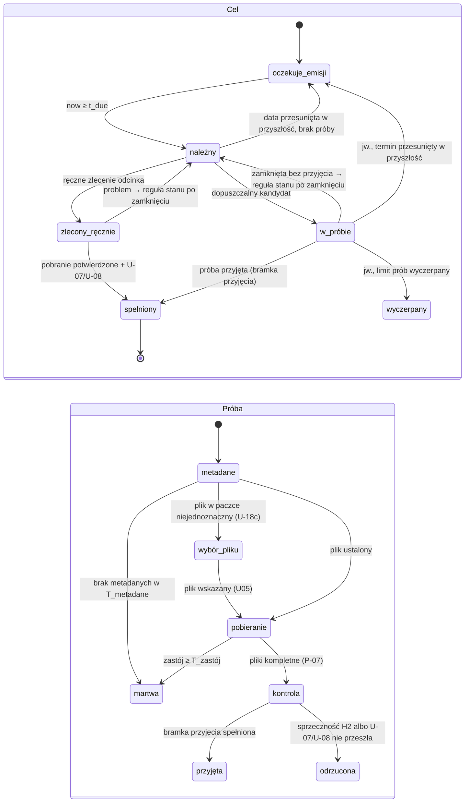

# Projekt przepływu: pobieranie ręczne i subskrypcja

Przepływ jednego odcinka w obu ścieżkach, parametry otwarte i sposób ich rozstrzygnięcia.
Podstawa: `spec.md`, `ux.md`, D-1..D-5 i K-01..K-13 z `e1-decyzje-subskrypcji-2026-09-28.md`.
Odstępstwa od nich wymienia §7.

**H1** — wyszukiwarka (`scripts/tmp/episode_selection.py`: `classify` →
`zgodny`/`niepewny`/`niezgodny`, `rank`). **H2** — kontrola po pobraniu
(`scripts/tmp/download_verification.py`: `ffprobe`, długość, obecność wideo).

## 1. Ustalenia właściciela (wiążące)

| Nr | Ustalenie |
| --- | --- |
| W-a | Ścieżka **ręczna**: wyemitowane odcinki użytkownik zaznacza i pobiera; H1 szereguje, użytkownik zatwierdza; nie wlicza się do subskrypcji. |
| W-b | Ścieżka **subskrypcji**: tylko odcinki niewyemitowane w chwili dodania; pobierane automatycznie. |
| W-c | H1 zawsze i natychmiast. H2 tylko dla automatycznych pobrań subskrypcji; o jej istnieniu decyduje pomiar. |
| W-d | Lepiej pobrać coś niż nic, ale ze skończonym limitem: 3 automatyczne próby na odcinek, potem problem i powiadomienie (decyzja 2026-09-28). Bez budżetu GB: subskrypcja pobiera świeże wydania WEB, wielkość nie świadczy o poprawności (podwójne odcinki, premiery), a ochronę daje limit prób. |
| W-e | Progi wynikają z pomiaru, nie z pytań do właściciela (poza limitem prób, W-d). |
| W-f | Przeniesiona stara subskrypcja: odcinki wyemitowane po jej utworzeniu i niepobrane są pobierane automatycznie po „Wznów”, tam gdzie to rozstrzygalne. |
| W-g | Przyjęte wydanie `niepewne` nie jest podmieniane automatycznie; zamiana tylko ręcznym „Pobierz ponownie” (E2). |
| W-h | Symulator: wszystkie seriale TV z AniList od zimy 2024, pozyskane raz do lokalnego cache, z podziałem strojenie/kontrola i wynikami osobno dla popularnych i niszowych — pod warunkiem wykonalności (§5.2); odłożony 2026-09-28 (§5.3). |
| W-i | Tryb cienia dopiero po wpięciu heurystyki, jako przełącznik aplikacji; integracja nie czeka na wyniki pomiarów. |
| W-j | Rejestr decyzji w `config/watch/`, cotygodniowy przegląd; poprawka wchodzi tylko po akceptacji właściciela. |
| W-k | Historia jako zestaw regresyjny; nie zastępuje ślepego egzaminu korpusu. |

## 2. Ścieżka ręczna

1. U01 → U02 → U03: zaznaczenie wyemitowanych odcinków „Nie zamówiono” (P-01).
2. `D`: jedno zapytanie Torrentio na odcinek, H1 ocenia każdą parę (hash, plik), `rank`
   układa (R-01, R-02).
3. U04: sugestia = najlepszy `zgodny`, bez niego najlepszy `niepewny` z oznaczeniem
   (U-03, R-06); zmiana w U04b (R-04).
4. „Pobierz” → trwałe zlecenie (P-04, U-16), wybór pliku wg U-18, tylko pliki zamówione (U-17).
5. Pliki kompletne (P-07) → kontrola języka i napisów U-07/U-08 → przetwarzanie → Biblioteka.
6. Bez H2 i bez limitu prób subskrypcji. Limit U-08 (dwa pobrania bez decyzji użytkownika) zostaje.

U06 nie zleca zaległych: zamiast „Teraz” — „Wyemitowane E1–E23 nie wchodzą do
subskrypcji · zaznacz je i D, aby pobrać”.

## 3. Ścieżka subskrypcji

### 3.1 Zakres i punkt odcięcia

- Przy dodaniu zapisywany jest trwale **punkt odcięcia**: `t_sub` oraz `n_cut` = liczba
  odcinków wyemitowanych według AniList w `t_sub`.
- **Cel** = wpis katalogu + lokalny numer zwykłego odcinka (K-05). Odcinek jest celem, gdy
  `airingAt > t_sub`; bez daty — gdy numer > `n_cut`. Wpis „zapowiedziany”: każdy odcinek.
- Odcinek odkryty później (nowy w AniList lub ani.zip) jest celem według tej samej reguły;
  wyemitowany przed `t_sub` (albo bez daty i ≤ `n_cut`) należy do ścieżki ręcznej.
- Przynależność nie zmienia się po zmianie daty emisji.
- **Termin** `t_due` = `airingAt`; bez daty — pierwsza obserwacja spełnienia U-15. Zegary
  liczą od `t_due`, są bezwzględne, restart ich nie zeruje (K-07).

### 3.2 Migracja (sens M-01..M-03 zachowany)

- Przyjęcia (taken) zostają zleceniami (M-02); stan włączona/wstrzymana zostaje (M-01),
  z wyjątkiem poniżej; zakończona z brakami → wstrzymana (M-03).
- `t_sub` = data utworzenia ze starego pliku. Niepobrane odcinki z `airingAt` po tej dacie
  są celami.
- Subskrypcja, która w chwili migracji ma należne, niespełnione cele (`t_due` przed
  migracją), startuje jako **wstrzymana**, także gdy była włączona; te cele ruszają dopiero
  po „Wznów” (W-f, U-20). Bez takich celów stan zostaje bez zmian.
- Nierozstrzygalne (brak daty utworzenia, brak daty odcinka) nie stają się celami —
  zostają w ścieżce ręcznej, z notką w szczegółach subskrypcji.

### 3.3 Cel, próba, dopuszczalność, limit prób

**Próba** = jedno automatyczne pobranie jednej pary (hash, plik). Cel ma najwyżej jedną
aktywną próbę. Bieżący stan celu i próby oraz powód trzyma istniejący właściciel zleceń
(`AutomationOwner`, I-01); rejestr (§5.6) jest tylko dowodem do przeglądu.

Kandydat jest **dopuszczalny**, gdy wszystkie:

- `zgodny`; albo `niepewny`, gdy **brak dopuszczalnego, niewypróbowanego `zgodnego`**,
  minął `T_niepewny` (P-2), numer w nazwie wskazuje cel w jego numeracji i brak jawnej
  sprzeczności dzieła, sezonu, rodzaju materiału (D-3.4, K-05; `12.5` ≠ E12);
- para nie była próbą tego celu i nie jest plikiem przyjętym dla innego celu subskrypcji;
- nigdy `niezgodny`;
- < 1080p dopiero po `T_rozdzielczość` (P-5).

Wybór: pierwszy dopuszczalny według `rank`.

**Limit prób celu** = `N_prób` (P-3) = 3 automatyczne próby (W-d). Liczą się wszystkie
próby celu: martwe, odrzucone i zastąpione ręcznie. Licznik jest trwały w stanie
właściciela; restart go nie zeruje. Rozmiar wydania nie jest kryterium dopuszczalności
ani przerwania próby (W-d). Wyczerpanie limitu blokuje kolejne próby, nie dyskwalifikuje
próby już ukończonej.

**Stan po zamknięciu próby lub zlecenia ręcznego** (jedna reguła, w kolejności):
limit prób wyczerpany → `wyczerpany`; `now < t_due` → `oczekuje_emisji`; w przeciwnym razie
`należny`. Pauza lub usunięcie subskrypcji nie zmienia stanu, tylko blokuje nowe próby.

**Bramka przyjęcia:** próba jest `przyjęta` wyłącznie, gdy H2 jest **wyłączona** (decyzja
„wypada”, §5.4) albo zakończyła się wynikiem dopuszczającym („brak sprzeczności”,
„nierozstrzygnięte”, „tylko zapis”, „niewykonana”), **i dodatkowo** kontrola języka
i napisów U-07/U-08 przeszła. Przy wyłączonej H2 nie ma probe, ponowień ani ostrzeżenia
„kontrola niewykonana”. Awaria włączonej H2 kończy tylko H2.

### 3.4 Inwarianty próby

- **Dopuszczenie do Auto wyprowadzone z wyniku próby:** plik próby automatycznej wchodzi do
  Auto (skan roota, restart, regeneracja; U-19, PR-05) tylko wtedy, gdy trwały wynik jego
  próby w stanie właściciela to `przyjęta`. Próba w toku, martwa, odrzucona bez
  usunięcia pliku i zastąpiona ręcznie — plik nigdy nie wchodzi automatycznie (chyba że
  ten sam plik jest wynikiem zlecenia ręcznego). Bez osobnego znacznika.
- **Zatrzymanie przed kolejną próbą:** próba martwa lub odrzucona najpierw zatrzymuje swój
  transfer — własny torrent: pauza i usunięcie z qB bez plików (I-04); torrent współdzielony
  z innym zleceniem: priorytet 0 plików tej próby. Następna próba startuje po potwierdzeniu.
- **Restart:** właściciel uzgadnia stan z qB (torrent, postęp, plik na dysku;
  `checkingResumeData` to nie zastój) i nie przekazuje ponownie do przetwarzania
  (przekazanie idempotentne po ID próby).
- **Ponowienie natychmiastowe** tylko, gdy reguła stanu po zamknięciu daje `należny`
  i monitoring jest aktywny.

### 3.5 Diagram

### 3.6 Tabela przejść

| Nr | Zdarzenie | Przed | Po | Działanie |
| --- | --- | --- | --- | --- |
| 1 | `now ≥ t_due` | oczekuje_emisji | należny | U-14 od `t_due + T_start` (P-1). |
| 2 | Zmiana daty emisji | oczekuje_emisji | oczekuje_emisji / należny | Przelicz `t_due`. |
| 3 | Data przesunięta w przyszłość | należny bez próby | oczekuje_emisji | Nowe `t_due`. |
| 4 | Zmiana daty w trakcie próby | w_próbie | w_próbie | Próba trwa; nowe `t_due` działa od zamknięcia próby (reguła stanu po zamknięciu). |
| 5 | Jest dopuszczalny `zgodny` | należny | w_próbie | Próba z najlepszym. |
| 6 | Brak dopuszczalnego, niewypróbowanego `zgodnego`; dopuszczalny `niepewny` | należny | w_próbie | Plik oznaczony „niepewne wydanie”. |
| 7 | Brak dopuszczalnego | należny | należny | Następne sprawdzenie U-14; po 7 dobach jedno powiadomienie (S-14). |
| 8 | Błąd źródła (sieć, 429, 403; pusta odpowiedź = brak kandydatów, R-08) | należny | należny | Nie zużywa próby; odstęp `RequestControl`/U-14. |
| 9 | Usunięte (decyzja 2026-09-28, W-d): rozmiar nie jest kryterium, brak prób „pominiętych”. | — | — | — |
| 10 | Plik w paczce niejednoznaczny (U-18c) | w_próbie | w_próbie | Istniejący ręczny wybór pliku U05. |
| 11 | Brak metadanych albo zastój (P-9) | w_próbie | reguła stanu po zamknięciu | „Martwa”: zatrzymaj transfer (§3.4); zużywa próbę. |
| 12 | Bramka przyjęcia spełniona (§3.3) | w_próbie | spełniony | Plik dopuszczony do Auto (§3.4); „niepewne” zostaje przy kandydacie `niepewnym` (K-01); „kontrola niewykonana” widoczna, jeśli dotyczy. |
| 13 | Sprzeczność H2 albo U-07/U-08 nie przeszła | w_próbie | reguła stanu po zamknięciu | Zatrzymaj transfer; usuń plik tylko przy warunkach K-09; para wykluczona. |
| 14 | H2 włączona: timeout albo zły JSON | w_próbie | w_próbie | Jedno ponowienie po `T_kontroli`; drugi raz → w. 15. |
| 15 | H2 włączona: brak binarki albo drugi timeout | w_próbie | w_próbie | H2 kończy się wynikiem „niewykonana” (bez ponawiania przy braku binarki), wpis w rejestrze, także dla `zgodnego`; dalej U-07/U-08 i bramka przyjęcia (w. 12/13). Bez dodatkowej próby. |
| 16 | Limit prób wyczerpany | w_próbie | wyczerpany | Trwałe (K-09); problem „E6: wyczerpano próby (3 z 3)” i powiadomienie (W-d); rozwiązanie przez `I`/`P`. |
| 17 | Ręczne zlecenie odcinka (U04 albo `P`) | należny / w_próbie / wyczerpany | zlecony_ręcznie | Rezerwuje cel, blokuje duplikat (I-06). Aktywna próba automatu: zatrzymanie transferu (§3.4), wynik „zastąpiona ręcznie”; próba liczy się do limitu. |
| 18 | Zlecenie ręczne: pobranie potwierdzone i U-07/U-08 bez problemu | zlecony_ręcznie | spełniony | Bez H2 (I-02: zlecenie ≠ pobrano). |
| 19 | Zlecenie ręczne kończy się problemem | zlecony_ręcznie | reguła stanu po zamknięciu | Automat szuka dalej w pozostałym limicie prób, o ile monitoring aktywny. |
| 20 | Restart | dowolny | ten sam | Uzgodnienie z qB bez ponownego przekazania (§3.4). |
| 21 | Pauza subskrypcji (S-07) | dowolny | ten sam | Bez sprawdzeń i nowych prób; aktywna próba kończy się; zegary biegną. |
| 21a | Pauza globalna (S-11) | dowolny | ten sam | Bez sprawdzeń i nowych prób; transfery automatu z zastosowaną selekcją (także aktywna próba) zatrzymane jak w E2, po wznowieniu kontynuowane; transfer w fazie metadanych nie jest zatrzymywany (E2 nie wznawia bezpiecznie transferu zatrzymanego przed listą plików) ani obserwowany. Żaden zegar próby (`T_zastój`, `T_metadane`) nie nalicza czasu pauzy, a czas naliczony przed pauzą jest zachowany; zegary celu (U-14, S-14) bezwzględne od `t_due`. (decyzja orkiestratora 2026-10-02, do potwierdzenia) |
| 22 | Usunięcie subskrypcji (S-08) | dowolny | zamrożony | Aktywna próba kończy się z kontrolą i przetwarzaniem (K-10); po odrzuceniu **brak następnej**. Ctrl+Z przywraca cele ze zużytymi próbami. |
| 23 | Konflikt katalogu (K-06) | należny | należny, zablokowany | Odśwież dane; problem widoczny; bez nowych prób; numeracja bez zmian. |
| 24 | Konflikt ustąpił | należny, zablokowany | należny | Zdjęcie problemu; zwykły harmonogram. |
| 25 | Wpis zakończony, liczba znana, wszystkie cele spełnione | — | koniec subskrypcji | U-11, S-09; `wyczerpany` blokuje zakończenie. |

## 4. Parametry otwarte i wybór

| Nr | Parametr | Steruje | Start | Źródło pomiaru |
| --- | --- | --- | --- | --- |
| P-1 | `T_start` | pierwsze sprawdzenie po `t_due` | 0 (U-14; decyzja 2026-09-28); dziś 3 h | ustalone; opóźnienie Torrentio potwierdza rejestr/cień po integracji (§5.1) |
| P-2 | `T_niepewny` | kiedy wolno `niepewnego` | 72 h — konfiguracja tymczasowa | rejestr decyzji po uruchomieniu; symulator, siatka {0, 1, 3, 6, 12, 24, 72 h}, tylko gdy rejestr nie wystarczy (§5.3) |
| P-3 | `N_prób` | próby na cel (tożsamość + napisy, K-09) | 3 — ustalone przez właściciela (W-d) | nie jest mierzony |
| P-4 | `B_cel` — Usunięte (decyzja 2026-09-28, W-d): budżet GB na cel | — | — | — |
| P-5 | `T_rozdzielczość` | czekanie na 1080p | 0 (U-04/U-05) | rejestr decyzji po uruchomieniu; symulator {0, 1, 3 h}, tylko gdy rejestr nie wystarczy (§5.3) |
| P-6 | tolerancje H2 | granice długości | wartości z kodu | §5.4 |
| P-7 | H2 | zostaje / wypada | wł. | §5.4 |
| P-8 | `T_kontroli` | limit `ffprobe`, odstęp ponowienia | 30 s | §5.4: 10 × P95, min. 5 s |
| P-9 | `T_metadane`, `T_zastój` | próba martwa | — / 30 min | N-03; logi E3 |
| P-10 | rzednienie U-14 | obciążenie Torrentio | brak | rejestr po integracji: przy ≥ 1 serii 429 pierwsza doba co 30 min |

Nie są otwarte: harmonogram U-14, powiadomienie po 7 dobach, ranking U-04/U-05, lektor zawsze, limit prób P-3 = 3.

**Wybór P-2, P-5** (na rejestrze decyzji; przy symulatorze na części strojeniowej, wynik
na kontrolnej, osobno popularne i niszowe). Kolejność kryteriów:

1. najwięcej celów **poprawnie** spełnionych w 7 dni (wybrany plik = właściwy odcinek według
   etykiet A/B);
2. najmniej złych pobrań nieprzechwyconych przez H2;
3. najmniejsze opóźnienie P90.

Kryterium 2 pochodzi z jawnie modelowanych scenariuszy (§5.3), nie z pomiaru.
Siatka nie zawiera wartości „nigdy”, więc wynik zawsze pobiera. Raport kompromisu (najlepsza
konfiguracja i sąsiednie: co zyskują, co tracą) idzie do akceptacji właściciela.

Bez symulatora (odłożony, §5.3) P-2 i P-5 wynikają z rejestru decyzji (§5.6); do tego
czasu obowiązuje konfiguracja tymczasowa.

Wybór parametrów jest rozdzielony od bramki H1: H1 nadal musi mieć 0 błędnych `zgodnych`
rozpoznawalnych z nazwy/metadanych (K-03) w ślepym egzaminie; parametry przepływu tego nie
zmieniają.

Integracja nie czeka na pomiar. **Konfiguracja tymczasowa** pozwala włączyć automat zaraz
po integracji: P-2 = 72 h, P-3 = 3, P-5 = 0; H2 w trybie „tylko zapis” do decyzji §5.4.
Wartości idą do akceptacji właściciela razem z integracją. Rejestr (§5.6), a w razie potrzeby symulator (§5.3), zastępuje konfigurację tymczasową w kroku 5; każda zmiana
parametru przechodzi raport kompromisu.

## 5. Weryfikacja

Pomiary §5.1–§5.4 to jednorazowe skrypty w `scripts/tmp/`
(gitignorowane); wyniki w `workspace/.archive/acquisition/evidence/e1/flow/` (< 500 KiB,
bez sekretów i ścieżek absolutnych). Jeden format zapisu: JSONL (`json` ze stdlib).
Bez nowych zależności.

### 5.1 N-01 — świeżość źródeł

- **Zastąpione (decyzja właściciela 2026-09-28):** pomiar na żywo przez 7 dni nie jest
  wykonywany — lokalny przebieg zatrzymano po kilku minutach, archiwum zachowane. Tryb
  `freshness` nie powstaje.
- **Pilot historyczny** (`%USERPROFILE%\acquisition-history\pilot\report.md`; 5 seriali TV
  z zimy 2024, 73 odcinki; izolacja egzaminu zachowana według §5.3): Torrentio ma dziś
  ≥ 1 `zgodny` dla 73/73 odcinków; 0 odcinków ze `zgodnym` tylko w Nyaa. Nyaa: pierwszy
  `zgodny` P50 1,51 h, P90 2,60 h po emisji (61/73; 12 braków to słabość wyszukiwania po
  jednym tytule, późniejsza paczka). Historia nie mówi, kiedy hash trafił do Torrentio;
  według właściciela wydania WEB (Crunchyroll/Netflix) są od razu, inne zwykle po ~1 h,
  do ~5 h.
- **Decyzja U-02:** Torrentio jest jedynym źródłem kandydatów dla subskrypcji i Pobierz;
  Nyaa nie jest drugim źródłem. P-1 = 0 (U-14 co 15 min od emisji). Opóźnienie Torrentio,
  liczbę 429 (P-10) i M-6 (czas do dodatniego `episodes["<n>"].length` w ani.zip dla
  świeżych odcinków) potwierdza rejestr (§5.6, wpisy `check`) i tryb cienia (§5.5) po integracji.

### 5.2 Próba wykonalności osi historycznej

`nyaa.py:search_releases` czyta RSS (l. 125–170) — tylko najnowsze wpisy, bez historii.
Przed symulatorem mała próba na 5 serialach z zimy 2024. Wykonuje ją **opiekun**: serie wybiera po odfiltrowaniu przecięcia z manifestem podziału i rezerwą (procedura izolacji z §5.3), a autorowi przekazuje tylko agregaty (odsetki, liczby zapytań, dostępność pól):

- czy stronicowane wyszukiwanie Nyaa (HTML, bez logowania) daje wszystkie wydania
  odcinków z datą uploadu, nazwą, rozmiarem, hashem;
- czy strona wydania daje listę plików (nazwy dla H1, które `classify` ocenia po pliku);
  kandydat bez listy plików ma status „brak nazwy pliku” i jest raportowany osobno, poza
  metrykami głównymi;
- tempo: istniejący `RequestControl` (odstęp 1 s dla Nyaa), `USER_AGENT` z `nyaa.py`,
  jedno pozyskanie do lokalnego cache, stop przy 429/403;
- wynik: odsetek odcinków z pełną osią i szacunek liczby zapytań dla ~500–700 serii.

Negatywna próba = brak danych historycznych; symulator odpada, parametry według
zapasowej reguły §4. Brak historii nie jest traktowany jako „brak wydania”.

**Wykonana 2026-09-28** jako pilot z §5.1: oś historyczna Nyaa jest dostępna; szacowany
koszt pełnej skali ~33–47 h zapytań.

### 5.3 Symulator (odłożony)

- **Odłożony (decyzja właściciela 2026-09-28):** P-2 (tymczasowo 72 h) i P-5 (0) są
  strojone na rejestrze decyzji po uruchomieniu (§5.6). Symulator na historii Nyaa
  (~33–47 h zapytań, §5.2) powstaje tylko, jeśli rejestr nie wystarczy; wtedy obowiązuje
  opis poniżej.
- **Próbka:** wszystkie seriale TV/TV_SHORT/ONA z AniList od zimy 2024; podział strojenie/
  kontrola z ziarnem 20260925; znacznik popularne/niszowe (mediana popularności AniList).
- **Osie:** emisja z AniList `airingSchedule`; wydania z cache §5.2; opóźnienie Torrentio
  z rejestru (§5.6) dodane do czasu uploadu.
- **Izolacja egzaminu H1 (przed udostępnieniem czegokolwiek autorowi):** opiekun, nie
  autor, porównuje listę serii symulatora z manifestem podziału
  `%USERPROFILE%\acquisition-labels\split-v1-labels-fix3` (tylko manifest: klucze grup
  i ich przypisanie; zawartości części egzaminacyjnej nie otwiera) oraz z membership
  rezerwy korpusu (`reserve/membership.json`), po kluczu grupy użytym w podziale
  i po AniList ID. Serie z przecięcia są usuwane z każdej części widocznej dla autora
  (strojenie, kontrola, raporty per seria), chyba że właściciel jawnie wycofa je z egzaminu
  i wskaże nową rezerwę. Autor dostaje przefiltrowany cache i liczby wyłączeń; skala
  pozostaje „wszystkie seriale TV od zimy 2024 minus chronione”.
- **Prawda:** wybory dowolnej konfiguracji oceniają A/B istniejącym `corpus_labels.py`
  (procedura N-02), z klasą błędu: para, fragment, kompilacja, inny odcinek, inne dzieło,
  dodatek.
- **Replay = tylko decyzja wyboru:** na zegarze symulowanym, prawdziwe `classify`/`rank`
  i reguły dopuszczalności §3.3: **kiedy** pojawia się pierwszy dopuszczalny kandydat
  i **który** jest wybrany. Metryki mierzone: M-1 opóźnienie emisja → wybór (P50, P90);
  M-2 cele z poprawnym wyborem w 7 dni (etykiety); M-3 złe wybory według klasy błędu;
  M-7 wybory < 1080p przy późniejszym 1080p; przyjęte `niepewne`.
- **Scenariusze modelowane (nie pomiar skuteczności):** ponowienia i napisy liczone
  z jawnych założeń: H2 odrzuca złą próbę tylko w klasach wykrywalnych i tylko przy
  `length` dostępnym według M-6; brak napisów nie jest modelowany (wymaga N-05). M-4
  (pobrane GB, z deklarowanego rozmiaru) jest wyłącznie informacją, bez wpływu na wybór
  parametrów. Wyniki M-4 i skutki limitu prób oznaczone jako „model”.
- **Przybliżenie (jawne):** Nyaa zastępuje Torrentio; seedy z dnia pozyskania; kandydaci
  „brak nazwy pliku” poza metrykami głównymi.

### 5.4 H2 — reguły, wartość, decyzja

- **Syntetyki (sprawdzenie reguł):** `external/bin/ffmpeg/ffmpeg.exe` (`lavfi`), MKV:
  poprawny, para, fragment, kompilacja, podwójna premiera (katalog 47 min i średnia
  24 min), sam dźwięk, okładka bez wideo, ucięty plik, drobne różnice; każdy dla 24 i 3 min
  i trzech źródeł długości. Oczekiwanie wg K-04: twarde odrzucenie długości tylko przy
  `anizip.length` konkretnego odcinka **i braku sygnału sprzecznych granic odcinka** w
  katalogu (np. dwa odcinki katalogu → ten sam numer TVDB); inaczej nierozstrzygnięte.
  Brak wideo → zawsze odrzucenie. Nagrane JSON `ffprobe` trafiają do testów.
- **Realne pliki (fałszywe odrzucenia, czas):** 20–30 poprawnych odcinków z Biblioteki
  właściciela (tylko odczyt metadanych `ffprobe`); czas P50/P95 na Windows.
- **Realna para (wartość):** co najmniej jedna udokumentowana para dla tego samego celu —
  plik referencyjny właściwego odcinka + błędny plik (klasa z korpusu, np. rozjazd
  numeracji) + wynik H2 i wartości katalogu. E1 nie pobiera mediów, więc para pochodzi
  z plików, które właściciel już ma, albo z pierwszych pobrań od E2 (rejestr, §5.6).
- **Decyzja** (bez zależności od cienia):
  - **zostaje:** ≥ 1 udokumentowana realna para z poprawnym odrzuceniem, 0 fałszywych
    odrzuceń na realnych poprawnych i syntetykach, P95 ≤ 5 s;
  - **wypada:** fałszywe odrzucenie, którego P-6 nie usuwa bez utraty wykryć; albo
    wystarczające dane (korpus 2021+ z M-6, realne pary) pokazują 0 wykrywalnych złych
    pobrań. **Brak danych ≠ zero wykryć;**
  - **nierozstrzygające** (brak realnej pary, za mało danych, P95 > 5 s): tryb „tylko zapis”
    — H2 działa i zapisuje wynik do rejestru, nie odrzuca z powodu długości; brak wideo
    nadal odrzuca; odcinek nie czeka dłużej niż sama kontrola (najwyżej dwa odczyty po `T_kontroli`
    i odstęp ponowienia, w. 14).
    Decyzja wraca w cotygodniowym przeglądzie, gdy pojawi się para.

### 5.5 Tryb cienia (opcjonalny, po integracji)

Przełącznik aplikacji: subskrypcje przechodzą maszynę stanów, ale zamiast próby zapisują
propozycję w rejestrze; bez qB i plików. **Nie jest bramką** uruchomienia automatu.
Siatka parametrów liczona offline na zapisanych obserwacjach. Tylko metryki obserwowalne
bez transferu: czas do pierwszego dopuszczalnego kandydata, rodzaj wyboru, ocena A/B
wyboru, rozjazd z symulatorem.

### 5.6 Rejestr decyzji i przegląd

`config/watch/decisions.jsonl` — tylko dopisywanie, zapisuje `AutomationOwner`, osobno od
logów. Każda linia: `schema`, wersja reguł H1, wersja parametrów, czas, `kind`, cel, ścieżka
(`ręczna`/`subskrypcja`/`cień`). Minimalne wejścia do replayu, bez pełnych payloadów API,
sekretów, ścieżek absolutnych, podpisanych URL-i i trackerów:

| `kind` | Treść |
| --- | --- |
| `selection` | Snapshot faktycznych wejść `classify`/`rank`: cel (AniList ID, numer lokalny/TVDB/absolutny, tytuły i aliasy, tytuły odcinków, rok, format, sąsiednie dzieła); kandydaci (hash, nazwa wydania, ścieżka w torrencie, nazwa pliku, rozmiar, seedy, rozdzielczość, PL/MultiSub/platforma, języki). Kontekst: `t_due`, czas sprawdzenia, wykluczone pary z wcześniejszych prób, liczba zużytych prób, wersja parametrów. Wynik: ocena H1 i powód każdego kandydata, wybór i powód. Lista pól = schemat `schema`; nic ponad nie. |
| `selection` — kiedy | Tylko przy starcie próby, przy zmianie zbioru kandydatów lub decyzji względem poprzedniego wpisu celu oraz przy każdym wyborze ręcznym; puste i niezmienione sprawdzenia U-14 nie dopisują `selection` (każdy odczyt zapisuje `check`). |
| `attempt` | Numer próby, wynik próby, wynik H2 i powód, wynik U-07/U-08. |
| `correction` | Korekta użytkownika z powodem `jakość` (inne wydanie tego samego odcinka) albo `zły_odcinek`: „Pobierz ponownie”, ręczny wybór wydania, wybór pliku U05. |
| `escalation` | 7 dni, wyczerpanie, konflikt katalogu, „kontrola niewykonana”. |
| `check` | Surowy odczyt źródła dla celu (opóźnienie Torrentio, 429/P-10, M-6): jedna zwarta linia na każdy odczyt, dopisywana od razu po odczycie. Pola: czas odczytu; źródło `torrentio` / `anizip`; cel (seria + odcinek); `aired_at` celu (czas emisji z AniList, jeśli znany; brak → wpis nie wchodzi do rozkładu „od emisji”); wynik z zamkniętej listy — Torrentio: `brak` / `kandydaci` / `zgodny` / `429` / `błąd`; ani.zip: `brak_length` / `length` / `błąd`. Bez nazw, hashy, payloadów, ścieżek i sekretów. Lista pól = schemat `schema`; nic ponad nie. |
| `check` — analiza | Luki, kompletność i rozkłady opóźnień liczy analiza offline z surowych czasów, osobno per źródło. Tylko poprawne odczyty (nie `429` / `błąd`) potwierdzają brak lub obecność. Lukę wyznacza analiza według harmonogramu U-14/P-10 obowiązującego w chwili odczytu. Restart zachowuje zapisane wpisy; niezapisany odczyt pozostaje brakiem obserwacji; brak wpisów = brak obserwacji, nigdy potwierdzony brak. |
| `check` — objętość | Przy odczycie obu źródeł na sprawdzenie U-14: ok. 2 × 96 linii w pierwszej dobie, 2 × 24 na dobę do 72 h, potem 2 na dobę — ok. 300 linii na cel w 7 dni (P-10 co 30 min zmniejsza pierwszą dobę o połowę). Rotacja/retencja to temat E3, jeśli w ogóle. |

Co tydzień agent przygotowuje raport (złe pobrania, eskalacje, korekty) i może zaproponować
poprawkę z testem na osobnej gałęzi; wchodzi tylko po akceptacji właściciela.

### 5.7 Historia jako zestaw regresyjny

- Obserwacja z rejestru ≠ etykieta. Do bazy trafia tylko przypadek **jawnie zweryfikowany**
  w przeglądzie: potwierdzony właściwy odcinek albo korekta z powodem.
- Baza lokalnie w `config/watch/cases.jsonl` (historia oglądania, poza gitem); do
  `tests/fixtures/` tylko przypadki zatwierdzone w przeglądzie (decyzja 2026-09-28).
- Każda zmiana heurystyki lub parametrów jest odtwarzana na całej bazie i na części
  roboczej korpusu. Test sprawdza: wybrany kandydat to właściwy odcinek, jest dopuszczalny
  i spełnia kontrakt rankingu (U-04/U-05) — nie ten sam hash. Korekta `zły_odcinek`:
  wskazane wydanie nie może wrócić jako wybór. Naruszenie = test czerwony przed wejściem zmiany.
- Baza jest znana autorowi heurystyki, więc **nie zastępuje ślepego egzaminu** — ten
  nadal wymaga świeżych przypadków (rezerwa, K-7 w `e1-heurystyka-wyszukiwarka-weryfikator.md` §4).

## 6. Kolejność

Tory A i B równolegle; B nie czeka na wyniki A.

| Krok | Tor | Wynik | Warunek przejścia |
| --- | --- | --- | --- |
| 1 | A | Pilot historyczny zamiast N-01 na żywo (§5.1, §5.2) | wykonany 2026-09-28; decyzja U-02 |
| 2 | A | H2: syntetyki i realne pliki (§5.4) | decyzja H2 albo „tylko zapis”; P-6, P-8 |
| 3 | A | Symulator (§5.3) odłożony — tylko, jeśli rejestr nie wystarczy | izolacja egzaminu jak w §5.3; metryki albo jawny brak danych |
| 4 | B | Aktualizacja spec/ux (§7); integracja: rejestr ścieżki ręcznej w E2, maszyna stanów, limit prób, H2 w przepływie i przełącznik cienia w E3 (`masterplan.md`) | bramki `AGENTS.md` |
| 4a | B | Konfiguracja tymczasowa (§4), akceptacja właściciela | automat może działać po integracji |
| 5 | A+B | Wybór P-2, P-5 z rejestru decyzji (§4), akceptacja raportu kompromisu | zastąpienie konfiguracji tymczasowej |
| 6 | B | Praca produkcyjna, cień opcjonalnie, przegląd co tydzień (§5.6–§5.7) | — |

## 7. Zmiany w spec, ux i planach

**Bez zmian:** U-01, U-04–U-07, U-10, U-12, U-13, U-16–U-18, U-21–U-25; R-01–R-06,
R-08; P-01–P-04, P-06–P-08; S-03 (kolejność), S-04, S-06–S-09, S-11, S-12, S-14;
M-04–M-07; I-01–I-07; harmonogram U-14.

| Miejsce | Zmiana |
| --- | --- |
| U-09, S-01, U06 | Zakres = cele wg punktu odcięcia (§3.1); „od N” wyliczane; zamiast „Teraz” notka o zaległych. |
| S-02 | Usunięte: zaległe nie są zlecane przez subskrypcję. |
| S-05, S-10, klawisz `N` w U08 | Bez „Zmień od N”. |
| U-03 | W subskrypcji `niepewny` tylko wg §3.3; w ścieżce ręcznej bez zmian. |
| U-08 | W subskrypcji limit dwóch pobrań zastępuje limit 3 automatycznych prób celu (§3.3, W-d); ścieżka ręczna bez zmian. |
| U-11 | Liczone na celach; `wyczerpany` blokuje samozakończenie. |
| U-14, U-15 | Start od `t_due + T_start`; rzednienie P-10; `wyczerpany` nie jest szukany; `t_due` bez daty wg §3.1. |
| U-19, PR-05 | Plik próby automatycznej wchodzi do Auto tylko przy trwałym wyniku `przyjęta` (§3.4). |
| R-07 | Ta sama H1 i ranking; dopuszczalność w subskrypcji wg §3.3. |
| P-05, ux.md U03 „Pobierz ponownie” | (E2, W-g) Zastępowane wydanie wyłączone z wyboru; wybrane wydanie pokazane w podglądzie (U04) przed pobraniem, zamiast zlecenia „bez podglądu”. Ręczne zlecenie w trakcie subskrypcji rezerwuje cel (§3.6 w. 17–19). |
| P-07 | Próba subskrypcji przechodzi H2 przed tłumaczeniem/TTS (K-02), o ile H2 zostaje. |
| S-03, spec §5.5 | `Pobrano x/y`: y = liczba celów. Nowe stany/teksty: „Kontrola E6”, „Kontrola niewykonana”, „E6: wyczerpano próby (…)”. |
| S-13 | Log diagnostyczny bez zmian; treść decyzji w rejestrze. |
| I-08 | Powód trzyma właściciel zlecenia; rejestr jest kopią dowodową do przeglądu. |
| Pliki stanu (§3.1 spec) | Nowe `config/watch/decisions.jsonl` (§5.6) i `config/watch/cases.jsonl` (§5.7); wpis w „Dane runtime” `AGENTS.md`. |
| Nowe wymaganie | Przełącznik trybu cienia (opcjonalny, nie bramka). |
| M-01–M-03 | Punkt odcięcia i migracja wg §3.2 (W-f). |
| `AutomationPolicy` | Opóźnienie 3 h, okno 72 h, „3 próby przy błędzie źródła” zastąpione P-1, U-14 i w. 8. |
| K-13 „błąd kontroli → eskalacja” | Awaria włączonej H2 kończy tylko H2 („niewykonana”, widoczne, w rejestrze); przyjęcie nadal wymaga U-07/U-08 (w. 14–15, bramka przyjęcia). |
| D6 (`e1-wybor-odcinka.md`), runda 2 K-03 | Bramka H1 „0 błędnych `zgodnych`” liczona wśród przypadków rozpoznawalnych z nazwy/metadanych; pozostałe raportowane jako „domena heurystyki 2”. Wybór parametrów przepływu od niej oddzielony (§4). |
| Q-1..Q-3 | Q-1: U-03 (2026-09-26) — `niepewny` dostaje lektora i oznaczenie. Q-2: tak (K-02). Q-3: P-2; limit prób P-3 = 3 (W-d); zaległe są ręczne. |
| §14 | Dodatkowo: raport kompromisu parametrów, decyzja H2 (§5.4), replay historii bez naruszeń (§5.7); ślepy egzamin bez zmian. |
| U-02 | Torrentio jedynym źródłem dla subskrypcji i Pobierz; Nyaa nie jest drugim źródłem (decyzja 2026-09-28, §5.1). |
| N-01 | Pomiar na żywo zastąpiony pilotem historycznym i decyzją U-02 (§5.1); opóźnienie Torrentio, 429 i M-6 z rejestru/cienia po integracji. |
| `download_verification.py` | Twarde odrzucenie długości tylko przy `anizip.length` i braku sygnału sprzecznych granic (K-04); dziś przy każdym źródle. Poprawka w K-6. |

## 8. Poza zakresem

Automatyczna podmiana przyjętego `niepewnego` (W-g); budżet GB na odcinek i globalny
dobowy limit GB (W-d); rodzaj dodatków; zmiany kodu aplikacji przed akceptacją tego
dokumentu. Miejsce na dysku (sprawdzanie wolnego miejsca, sprzątanie oryginałów) to osobny
temat; wstrzymanie subskrypcji (S-07) i globalne (S-11) już istnieje.
